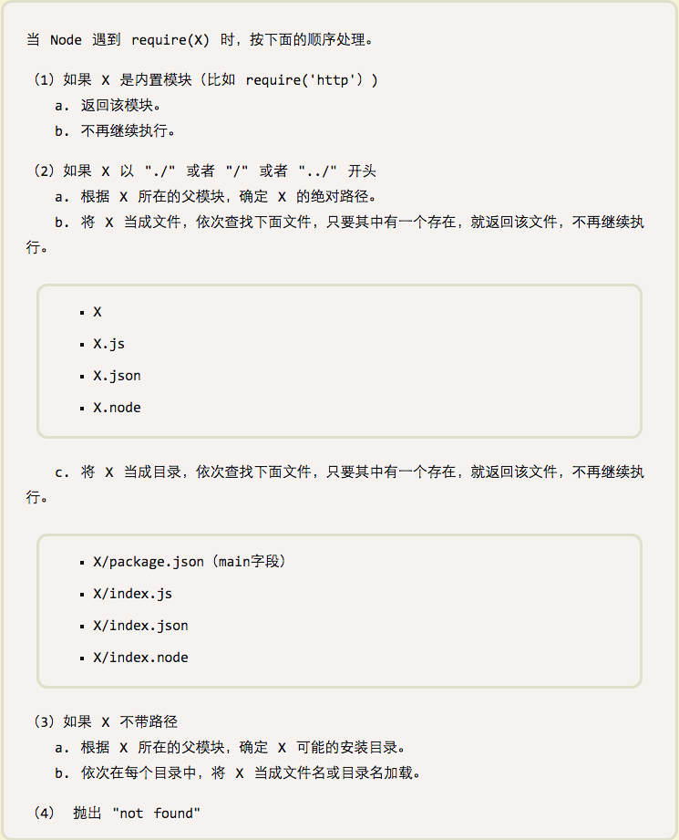

## 模块机制

    推荐使用 import export 来取代非标准的CMD AMD等。

* **import路径**

    - import Fetch from 'fetch.io';  从项目下的node_modules下找

    - import Fetch from './fetch.io';   从当前目录下找，相对路径

    - import Fetch from '../fetch.io';   从父级目录下找

    - import Fetch from '/fetch.io';    绝对路径

* **node模块机制**

    

    - require文件搜索

    
