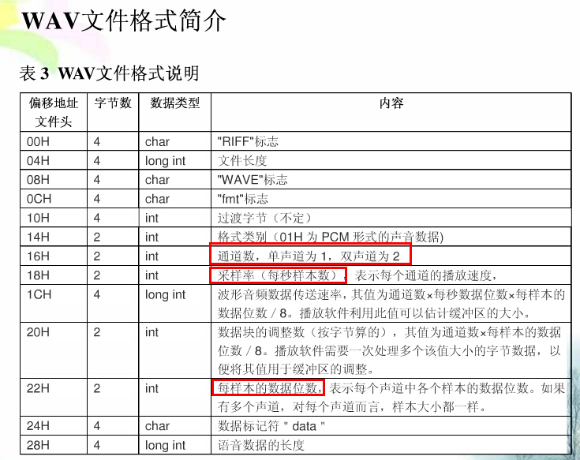
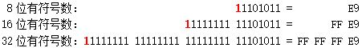

## 语音识别

* **语音**

  一种机械波，是器官或物件震动引起周围空气压强变动而形成的一种纵波，是一种连续的一维信号，随纵轴时间变化而变化。音频属于波，属模拟信号，采样是把它变成离散的量，点越多（间隔是相同的），线就越平滑，越接近于最初的曲线。可以通过计算机技术采样成无数的连续信号点，信号越多语音精准度越高，还原的语音越真实自然。

* **采样率**

  每秒对声音信号的采样次数，chrome64的web接口的采样率为48K，采样位深为16位。人类耳朵能分辨语音频率为20hz ~ 20khz的声音。录音后将混缩后的音频转成小采样率，初始采样数据的准确与否也会对平均之后的值产生巨大影响，也就是说，用96kHz录制，转成44kHz后的音频，明显优于44kHz录制后直接输出的音频。这就是为何chrome接口默认录音频率为48K，而不是16K。

  - 常见的采样率

    |   类型   |  采样率  |
    | -------- | ------- |
    |    电话   |    8K   |
    |  无线广播  |  22.05K |
    |  CD、MP3  |    44K   |
    | 数字电视、DVD、电影 | 48K |
    | 高清DVD、蓝光 | 96K、192K |

  - 采样率 vs 语音频率

  - 采样率转换

    chrome调用录音设备采样率为48K，转成16K的大概思路: 3个数据点取一个，优化可考虑数据更加圆润。

* **位深（位数）**

  对采样的点进行量化，例如：用16位的数据表示点的大小。

* **码流率（比特率）**

  码流率 = 采样率 * 位数，单位：bps 或者 kbps

* **声道**

  双声道、单声道

* **wav文件格式说明**

  PCM文件头长度为44个字节，Alaw和Ulaw未58个字节，不同类型的音频文件头差别很大。

  ```java
  /* RIFF WAVE file struct. 
  * For details see WAVE file format documentation  
  * (for example at http://www.wotsit.org). 
  */  
  typedef struct WAV_HEADER_S  
  {
    char            riffType[4];    //4byte,资源交换文件标志:RIFF     
    unsigned int    riffSize;       //4byte,从下个地址到文件结尾的总字节数   
    char            waveType[4];    //4byte,wav文件标志:WAVE      
    char            formatType[4];  //4byte,波形文件标志:FMT(最后一位空格符)   
    unsigned int    formatSize;     //4byte,音频属性(compressionCode,numChannels,sampleRate,bytesPerSecond,blockAlign,bitsPerSample)所占字节数  
    unsigned short  compressionCode;//2byte,格式种类(1-线性pcm-WAVE_FORMAT_PCM,WAVEFORMAT_ADPCM)  
    unsigned short  numChannels;    //2byte,通道数  
    unsigned int    sampleRate;     //4byte,采样率  
    unsigned int    bytesPerSecond; //4byte,传输速率  
    unsigned short  blockAlign;     //2byte,数据块的对齐，即DATA数据块长度  
    unsigned short  bitsPerSample;  //2byte,采样精度-PCM位宽  
    char            dataType[4];    //4byte,数据标志:data  
    unsigned int    dataSize;       //4byte,从下个地址到文件结尾的总字节数，即除了wav header以外的pcm data length  
  }WAV_HEADER;
  ```

  

* **端点检测**

  分析和判断连续有效语音的起始点和结束点。减少数据量，交互性更好。语音信号能量值的变化推算

* **降噪**

  语音信号被各种噪音干扰，甚至淹没的情况下，从噪音背景中提取有效语音信号，抑制和降低噪音干扰，提升语音识别率。提取噪音频谱，反向补偿运算。

<br />

## 浏览器的语音技术

WebRTC (Web Real-Time Communications) 是一项实时通讯技术，它允许网络应用或者站点，在不借助中间媒介的情况下，建立浏览器之间点对点（Peer-to-Peer）的连接，实现视频流和（或）音频流或者其他任意数据的传输。WebRTC包含的这些标准使用户在无需安装任何插件或者第三方的软件的情况下，创建点对点（Peer-to-Peer）的数据分享和电话会议成为可能。

* **AudioContext**

  AudioContext是一个音频上下文对象，一段音频到达扬声器进行播放之前，半路对其进行拦截，于是我们就得到了音频数据了，这个拦截工作是由window.AudioContext来做的，我们所有对音频的操作都基于这个对象。

  另外需要注意的是，语音上下文，每个需要启用一个线程，目前最大支持六个。

  ```js
  var audioCtx = new AudioContext();
  var source = audioCtx.createBufferSource();
  var scriptNode = audioCtx.createScriptProcessor(4096, 1, 1);  // a bufferSize of 4096
  ```

* **createScriptProcessor**

  ScriptProcessorNode 接口允许使用javaScript生成、处理、分析音频. 它是一个 AudioNode， 连接着两个缓冲区音频处理模块, 其中一个缓冲区包含输入音频数据，另外一个包含处理后的输出音频数据. 实现了 AudioProcessingEvent 接口的一个事件，每当输入缓冲区有新的数据时，事件将被发送到该对象，并且事件将在数据填充到输出缓冲区后结束。

  AudioContext.createScriptProcessor() 中bufferSize取值在256和16384之间，为2的N次方。ScriptProcessorNode.onaudioprocess方法入参audioProcessingEvent，audioProcessingEvent的两个属性，inputBuffer、outputBuffer都是AudioBuffer类型，分别代表录音设备录入的AudioBuffer，和经过JavaScript处理之后输出的AudioBuffer。


  [详情参见MDN官网](https://developer.mozilla.org/en-US/docs/Web/API/ScriptProcessorNode)

  ```js
  var myScript = document.querySelector('script');
  var myPre = document.querySelector('pre');
  var playButton = document.querySelector('button');
        
  // Create AudioContext and buffer source
  var audioCtx = new AudioContext();
  var source = audioCtx.createBufferSource();

  // Create a ScriptProcessorNode with a bufferSize of 4096 and a single input and output channel
  var scriptNode = audioCtx.createScriptProcessor(4096, 1, 1);
  console.log(scriptNode.bufferSize);

  // load in an audio track via XHR and decodeAudioData

  function getData() {
    request = new XMLHttpRequest();
    request.open('GET', 'viper.ogg', true);
    request.responseType = 'arraybuffer';
    request.onload = function() {
      var audioData = request.response;

      audioCtx.decodeAudioData(audioData, function(buffer) {
        var myBuffer = buffer;   
        source.buffer = myBuffer;
      }, function(e){
        console.error("Error with decoding audio data" + e.err)
      });
    }
    request.onprogress = function(event) {
      if (event.lengthComputable) {
        var percentComplete = (event.loaded / event.total * 100).toFixed(2);
        var percentText = 'Read wav file completion progress: ' + percentComplete + '%';
        progress.innerHTML = percentText;
      }
    }
    request.send();
  }

  // Give the node a function to process audio events
  scriptNode.onaudioprocess = function(audioProcessingEvent) {
    // The input buffer is the song we loaded earlier
    var inputBuffer = audioProcessingEvent.inputBuffer;
    // The output buffer contains the samples that will be modified and played
    var outputBuffer = audioProcessingEvent.outputBuffer;

    // Loop through the output channels (in this case there is only one)
    for (var channel = 0; channel < outputBuffer.numberOfChannels; channel++) {
      var inputData = inputBuffer.getChannelData(channel);
      var outputData = outputBuffer.getChannelData(channel);

      // Loop through the 4096 samples
      for (var sample = 0; sample < inputBuffer.length; sample++) {
        // make output equal to the same as the input
        outputData[sample] = inputData[sample];
        // add noise to each output sample
        outputData[sample] += ((Math.random() * 2) - 1) * 0.2;         
      }
    }
  }

  getData();

  // wire up play button
  playButton.onclick = function() {
    source.connect(scriptNode);
    scriptNode.connect(audioCtx.destination);
    source.start();
  }
        
  // When the buffer source stops playing, disconnect everything
  source.onended = function() {
    source.disconnect(scriptNode);
    scriptNode.disconnect(audioCtx.destination);
  }
  ```

* **AudioBuffer**

  AudioBuffer接口表示存在存储器里的短音频资产，利用AudioContext.decodeAudioData()方法从音频文件构建，或者利用 AudioContext.createBuffer()构建于原数据。一旦将其放入AudioBuffer，可以传递到一个 AudioBufferSourceNode进行播放。

  缓存区（buffer）包含以下数据：不间断的IEEE75432位线性PCM，从-1到1的范围额定，就是说，32位的浮点缓存区的每个样本在-1.0到1.0之间。

  AudioBuffer.getChannelData()返回一个 Float32Array，包含了带有频道的PCM数据，由频道参数定义（有0代表第一个频道）。
  
  [读取wav文件播放案例](./examples/readWav.html)

* **MediaDevices接口是WebRTC技术的接口之一**

  - MediaDevices.getUserMedia()方法提示用户允许使用一个视频和/或一个音频输入设备，例如相机或屏幕共享和/或麦克风。如果用户给予许可，就返回一个Promise 对象，MediaStream对象作为此Promise对象的Resolved［成功］状态的回调函数参数，相应的，如果用户拒绝了许可，或者没有媒体可用的情况下，PermissionDeniedError 或者NotFoundError作为此Promise的Rejected［失败］状态的回调函数参数。注意，由于用户不会被要求必须作出允许或者拒绝的选择，所以返回的Promise对象可能既不会触发resolve 也不会触发 reject。

  ```js
  navigator.mediaDevices.getUserMedia(constraints)
  .then(function(mediaStream) { ... })
  .catch(function(error) { ... })
  ```

* **RTCPeerConnection - 此功能某些浏览器尚在开发中**

  RTCPeerConnection 接口代表一个由本地计算机到远端的WebRTC连接。该接口提供了创建，保持，监控，关闭连接的方法的实现。

参考：[MDN - MediaDevices](https://developer.mozilla.org/zh-CN/docs/Web/API/MediaDevices/getUserMedia)

* **TTS(Text To Speech)**

  ```js
  var msg = new SpeechSynthesisUtterance('吃葡萄不吐葡萄皮，不吃葡萄倒吐葡萄皮！');
  msg.lang = 'zh';   // 中文
  msg.rate = 1;   // 语速
  msg.voice = speechSynthesis.getVoices().filter(function(voice) {
    return voice.name == 'Whisper';   // 轻声
  })[0];
  speechSynthesis.speak(msg);
  ```

* **STT(speech to text)** -  SpeechRecognition

* [语音图形化案例](https://mdn.github.io/voice-change-o-matic/)、 
  [语音图形化案例详解](https://developer.mozilla.org/zh-CN/docs/Web/API/Web_Audio_API)


## 其他概念

* buffer

  为数据缓冲对象，是一个类似数组结构的对象，可以通过指定开始写入的位置及写入的数据长度，往其中写入二进制数据。

* stream

  是对buffer对象的高级封装，其操作的底层还是buffer对象，stream可以设置为可读、可写，或者即可读也可写，在nodejs中继承了EventEmitter接口，可以监听读入、写入的过程。具体实现有文件流，httpresponse等~~

* 整数在计算机中的表示

  一个整数可能占 1 个、2 个或 4 个字节，即 8 个、16 个或 32 个二进制位。整数还分无符号数和有符号数。无符号数的所有二进制位都用于表示数值，于是 n 位无符号数的范围就是 0 到2^n-1，例如 8 位无符号数的范围是 0 ~ 255。有符号数则把最高位用作符号位，0 表示正数（或 0），1 表示负数。剩下的 n-1 位用于表示数值，正数直接表示，而负数则用「补码」表示 —— 负数-a的这 n-1 位的值是2^{n-1} - a。因此，n 位有符号数的范围是-2^{n-1}到2^{n-1} - 1，例如 8 位有符号数的范围是 -128 ~ 127。

　　举几个例子。正数 233 的二进制形式是 11101001，它用不同长度的无符号数和有符号数的表示如下图，红色的 0 表示符号     位。注意图中没有 8 位有符号数，因为 233 超出了 8 位有符号数的范围。

  

  再如，负数 -23 用不同长度的有符号数的表示如下图，红色的 1 表示符号位。-23 用 8 位有符号数表示的形式跟 233 用 8 位无符号数表示的形式是一样的，请读者自行验证。

  

* 浮点数在计算机中的表示

  int型整数变量，值为9（二进制写法为1001）。普通的32位计算机，用4个字节表示int变量，所以9就被保存为00000000 00000000 00000000 00001001，写成16进制就是0x00000009。

  根据国际标准IEEE 754，任意一个二进制浮点数V可以表示成下面的形式：

　 -（1）(-1)^s表示符号位，当s=0，V为正数；当s=1，V为负数。

　 -（2）M表示有效数字，大于等于1，小于2。

　 -（3）2^E表示指数位。

  十进制的-5.0，写成二进制是-101.0，相当于-1.01×2^2。那么，s=1，M=1.01，E=2。

  IEEE 754规定，对于32位的浮点数，最高的1位是符号位s，接着的8位是指数E，剩下的23位为有效数字M。对于64位的浮点数，最高的1位是符号位S，接着的11位是指数E，剩下的52位为有效数字M