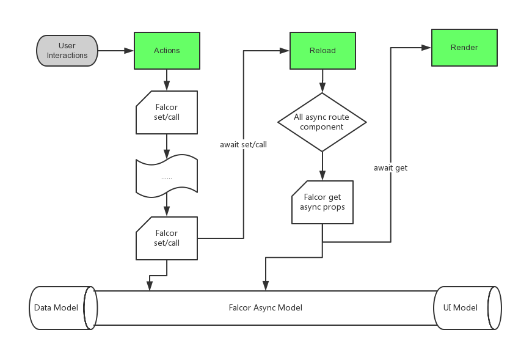

## Falcor

* 定义

    不同于传统 REST API，它只提供唯一的一个端点。有了它，开发者不再需要向不同的服务器端点请求不同的数据，而是向同一个端点请求不同的模型数据。服务器端可以识别请求参数，并由 Falcor Router 调用恰当的 router 函数。

    

* 特性

    - 从多个来源获取JSON数据提供了模型和异步机制。

    - 确保服务器永远不会返回不必要的模型数据，节省了带宽

    - 使用缓存数据为连续的请求提供服务，减少服务器响应时间

    - 减少前后台数据交互的耦合性

* 原理

    所有来自内存缓存或者多个数据库的后端数据，都通过一个虚拟JSON对象进行建模。这个JSON对象被称为“虚拟”，是因为从客户端的视角来看，这些数据来自内存，而事实上这些数据可能来自本地或者远程数据库。Falcor包含一个路由，它隐藏了实际数据存储，指示调用负责获取数据的相应后端服务。  

    另外，当数据获取回来后会被缓存起来，以避免后续对数据库的访问。Falcor也能够批处理多个请求，将它们合并成一个网络请求，如果当前已经有一个数据库请求，Falcor也不会重复请求。

* 其他

    Falcor类似GraphQL，GraphQL和Falcor是对REST的JSON的进化发展，GraphQL是一种嵌套的有层次的JSON
