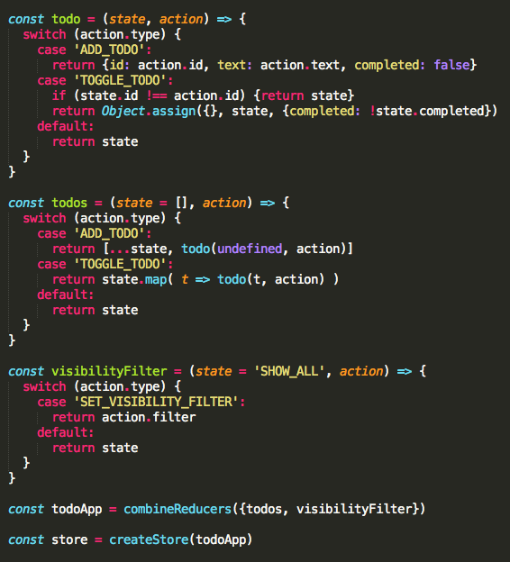

## redux

* 定义

    > Redux 是为 Javascript 应用而生的可预估的状态容器.

    

* redux几个概念

    - store: 应用数据的存储中心

    - action: 应用数据的改变的描述

    - reducer: 决定应用数据新状态的函数，接收应用之前的状态和一个 action 返回数据的新状态，reducer作为一个函数，可以根据web应用之前的状态（previousState）和交互行为（通过flux中提到的action来表征），决定web应用的下一状态（newState），从而实现state端的数据更新处理。

    - middleware: redux 提供中间件的方式，完成一些 flux 流程的自定义控制，同时形成其插件体系

* redux的原则

    - 单一的store

        区别于 flux 模式中可以有多个 state，整个应用的数据以树状结构存放在一个 state 对象中。

    - state 只读

        state 包含的应用数据不能随意修改，修改数据的唯一方式是 dispatch action，action 描述要修改的信息.

* 比较react

  - React有props和state: props意味着父级分发下来的属性，state意味着组件内部可以自行管理的状态，并且整个React没有数据向上回溯的能力，也就是说数据只能单向向下分发，或者自行内部消化。
