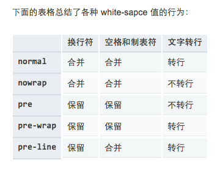

## css常见知识

* white-space: pre-wrap

  

* 多行溢出省略号

  ```css
  // 兼容性一般，需要兼容性好的，只能用js处理了
  overflow: hidden;
  word-break: break-all;
  word-wrap: break-word;
  text-overflow: ellipsis;
  display: -webkit-box;
  -webkit-line-clamp: 2;
  -webkit-box-orient: vertical;
  ```

* 白屏和无内容样式闪烁

  - 原因分析

  白屏和无样式内容闪烁的产生主要与浏览器的渲染机制有关，有的浏览器(chrome, 是等待html和css全部加载完成后再进行渲染（白屏问题），有的浏览器(Firefox)是先显示已加载的html内容，等到css加载完成后重新对内容添加样式（FOUC问题）


[参考引用](https://www.jianshu.com/p/db82a546267a)

[css滚动进度条效果](https://juejin.im/post/5c35953ce51d45523f04b6d2)