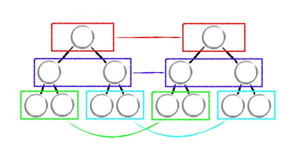

## react diff原理

根据新数据生成一个全新的Virtual DOM，然后跟上次生成的Virtual DOM去 diff，得到一个Patch，然后把这个Patch更新到浏览器的DOM上去，这里的patch是新的虚拟DOM和上一次的虚拟DOM经过diff后的差异化的部分。



* diff 策略

  - Web UI 中 DOM 节点跨层级的移动操作特别少，可以忽略不计。

  - 拥有相同类的两个组件将会生成相似的树形结构，拥有不同类的两个组件将会生成不同的树形结构。

  - 对于同一层级的一组子节点，它们可以通过唯一 id 进行区分。

* tree diff

  对树进行分层比较，两棵树只会对同一层次的节点进行比较。而对于不同层级的节点，只有创建和删除操作。

* component diff

  - 如果是同一类型的组件，按照原策略继续比较 virtual DOM tree。

  - 如果不是，则将该组件判断为dirty component，从而替换整个组件下的所有子节点。

  - 对于同一类型的组件，有可能其Virtual DOM没有任何变化，如果能够确切的知道这点那可以节省大量的diff运算时间，因此React允许用户通过 shouldComponentUpdate()来判断该组件是否需要进行 diff。

* element diff

  - 同一层级的同组子节点，添加唯一 key 进行区分


## react setState


```js
var Transaction = require('./Transaction');

// 我们自己定义的 Transaction
var MyTransaction = function() {
  // do sth.
};

Object.assign(MyTransaction.prototype, Transaction.Mixin, {
  getTransactionWrappers: function() {
    return [{
      initialize: function() {
        console.log('before method perform');
      },
      close: function() {
        console.log('after method perform');
      }
    }];
  };
});

var transaction = new MyTransaction();
var testMethod = function() {
  console.log('test');
}
transaction.perform(testMethod);

// before method perform
// test
// after method perform
```

## shouldComponentUpdate比较

PureRenderMixin的核心代码

```js
function shallowCompare(instance, nextProps, nextState) {
  return (
    !shallowEqual(instance.props, nextProps) ||
    !shallowEqual(instance.state, nextState)
  );
}

function is(x, y) {
  // SameValue algorithm
  if (x === y) {
    // Steps 1-5, 7-10
    // Steps 6.b-6.e: +0 != -0
    return x !== 0 || 1 / x === 1 / y;
  } else {
    // Step 6.a: NaN == NaN
    return x !== x && y !== y;
  }
}

function shallowEqual(objA, objB) { // 浅比较
  if (is(objA, objB)) {
    return true;
  }

  if (typeof objA !== 'object' || objA === null || typeof objB !== 'object' || objB === null) {
    return false;
  }

  var keysA = Object.keys(objA);
  var keysB = Object.keys(objB);

  if (keysA.length !== keysB.length) {
    return false;
  }

  // Test for A's keys different from B.
  for (var i = 0; i < keysA.length; i++) {
    if (!hasOwnProperty.call(objB, keysA[i]) || !is(objA[keysA[i]], objB[keysA[i]])) {
      return false;
    }
  }

  return true;
}

module.exports = shallowEqual;
```
