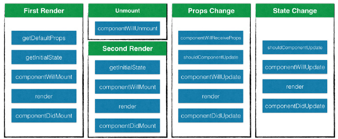

## React组件生命周期

  * 1、getDefaultProps  

  * 2、getInitialState  

  * 3、componentWillMount  

  * 4、componentWillReceiveProps

  * 5、shouldComponentUpdate
    > 组件重新渲染之前调用，函数的返回值确定了组件是否需要重新渲染。函数默认的返回值是 true，意思就是只要组件的 props 或者 state 发生了变化，就会重新构建 virtual DOM，然后使用 diff 算法进行比较，再接着根据比较结果决定是否重新渲染整个组件。函数的返回值为 false 表示不需要重新渲染。

  * 6、componentWillUpdate

  * 7、render

  * 8、componentDidUpdate

  * 9、componentDidMount

  * 10、componentWillUnmount

  

  第一次页面加载时候组件的生命周期如下：  
  ```
    getDefaultProps -> getInitialState -> componentWillMount -> render ->componentDidMount
  ```

  如果时在Redux（后面会讲到）里加载组件，则生命周期如下：  
  ```
  getDefaultProps -> getInitialState -> componentWillMount -> render ->componentDidMount
  -> componentWillReceiveProps -> shouldComponentUpdate
  ```

  组件更新时的生命周期：  
  ```
  componentWillReceiverProps -> shouldComponentUpdate -> componentWillUpdate -> render
  -> componentDidUpdate

  如果shouldComponentUpdate返回false，则 componentWillUpdate -> render -> componentDidUpdate这三个方法不会被触发:
  componentWillReceiverProps -> shouldComponentUpdate
  ```

  


## 详解生命周期

  
