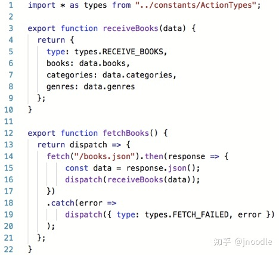
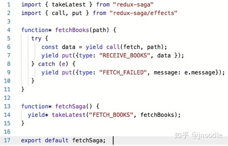

## dva

基于 redux，react-router，redux-saga 进行了上层封装，简化 redux 的写法，提升开发效率。


- 背景

解决多组件 state 共享问题，出现了 context，但过于底层没有调度管理，也不便维护，又出现了 redux、mobx 等。

redux 的痛点，对异步 action 有心无力，接着出现了 redux-thunk、redux-promise、redux-actions、redux-saga 等，中间件都能解决了异步问题。

但是 redux-saga 写法也很麻烦，watch 后还需要 fork，添加一个 async action 需要改动很多文件，而 dva 就是要解决这个麻烦。

- 现状

```js
// 最原始的redux写法
├── actions/
    ├── login.js
    ├── user.js                                         └── components/
└── api/                                                    |── login
    ├── login.js                                            |── user
    ├── user.js                                         └── consts/
└── components/                                             |── login
    ├── login.js            == 改进的docks写法 ==>            |── user
    ├── user.js                                         └── containers/
└── reducers/                                               |── login
    ├── login.js                                            |── user
    ├── user.js                                         |── ducks.js
└── consts/
    ├── login.js
    ├── user.js
```

每次改动都需修改四五个文件，后来社区为了避免这样的问题制定文件规范，推出了 ducks-modular-redux 规范，将每个子 module 的文件都放置到 docks.js 里，这样大大简化了日常开发中一些冗余工作。

- redux-thunk vs redux-saga

  

  ***

  

  async action 是 function，灵活但是形式各异，难以维护

  effects 使用 Generator

  async action 流程无法取消

  数据业务逻辑掺杂在 action 里

- 使用 dva vs 不使用 dva

```js
// 未用dva的redux-saga
├── actions/
    ├── login.js
    ├── user.js
└── reducers/                                             |── reducers/
    ├── login.js                  == dva ==>                  ├── login.js
    ├── user.js                                               ├── user.js
└── sagas/
    ├── login.js
    ├── user.js
```

- dva + umi 优势

  - 数据流简洁清晰易读，省去部分 Redux 代码，也不用来回切换目录

  - action 依然符合 FSA 标准的（即：a plain javascript object）

  - 文档相对齐全，大部分坑点都有对应的解决方案

  - 上手成本相对较低，有利于新人入手

  - 全局 loading

  - 约定式路由，省去 router 配置

- 缺点

  - 暴露的 api 少，破坏了 webpage.config 的 json 配置，许多配置不支持或者不建议，缺乏灵活性

  - 个人维护的项目

### 参考文档

[数据流各库的对比](https://zhuanlan.zhihu.com/p/53599723)
