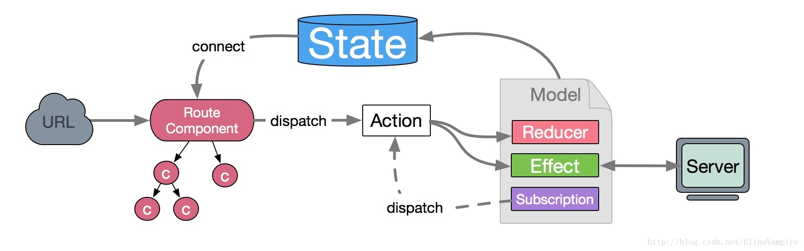

## 其他redux中间件

* redux-thunk

  ```js
  // sync thunk
  function add (x, y) {
    return x + y;
  }

  var thunk = function() {
    return add(10, 15);
  };

  thunk();    // 25

  // async thunk
  function addAsync (x, y, cb) {
    setTimeout(function(){
      cb(x + y);
    });
  }

  var thunk = function(cb) {
    addAsync(10, 15, cb);
  }

  thunk(function(sum) {
    console.log(sum);  // 25
  })

  // makeThunk
  function makeThunk(fn) {
    var args = [].slice.call(arguments, 1);   // 获取除fn以外的参数
    return function(cb) {
      args.push(cb);
      fn.apply(null, args);
    }
  }

  var thunk = makeThunk(addAsync, 10, 15);
  ```

  缺点：回调地狱


* redux-saga

  redux-saga 是一个用于管理应用程序 Side Effect（副作用，例如异步获取数据，访问浏览器缓存等）的 library，它的目标是让副作用管理更容易，执行更高效，测试更简单，在处理故障时更容易。

  redux-saga 是一个 redux 中间件，意味着这个线程可以通过正常的 redux action 从主应用程序启动，暂停和取消，它能访问完整的 redux state，也可以 dispatch redux action。

  redux-saga 使用了 ES6 的 Generator 功能，让异步的流程更易于读取，写入和测试。

  ```js
  import { call, put, takeEvery, takeLatest } from 'redux-saga/effects'
  import Api from '...'

  // worker Saga : 将在 USER_FETCH_REQUESTED action 被 dispatch 时调用
  function* fetchUser(action) {
    try {
        const user = yield call(Api.fetchUser, action.payload.userId);
        yield put({type: "USER_FETCH_SUCCEEDED", user: user});
    } catch (e) {
        yield put({type: "USER_FETCH_FAILED", message: e.message});
    }
  }

  /*
    在每个 `USER_FETCH_REQUESTED` action 被 dispatch 时调用 fetchUser
    允许并发（译注：即同时处理多个相同的 action）
  */
  function* mySaga() {
    yield takeEvery("USER_FETCH_REQUESTED", fetchUser);
  }

  /*
    也可以使用 takeLatest

    不允许并发，dispatch 一个 `USER_FETCH_REQUESTED` action 时，
    如果在这之前已经有一个 `USER_FETCH_REQUESTED` action 在处理中，
    那么处理中的 action 会被取消，只会执行当前的
  */
  function* mySaga() {
    yield takeLatest("USER_FETCH_REQUESTED", fetchUser);
  }

  export default mySaga;
  ```

  常见api

  put 用于触发 action，call 用于调用异步处理逻辑，select 用于从 state 中获取数据。详情如下：

  - take(pattern) 在 Store 上等待指定的 action。 在发起与 pattern 匹配的 action 之前，Generator 将暂停。  

  - takeEvery(channel, saga, ...args) 在发起（dispatch）到 Store 并且匹配 pattern 的每一个 action 上派生一个 saga。也就是说，takeEvery 允许处理并发的 action，包括相同的action，但不保证顺序。其中，saga: Function: 为一个 Generator 函数。

    ```js
    import { takeEvery } from `redux-saga/effects`;

    function* watchFetchUser() {
      yield takeEvery('USER_REQUESTED', fetchUser);
    }

    /* code content */
    const takeEvery = (patternOrChannel, saga, ...args) => fork(function*() {
      while (true) {
        const action = yield take(patternOrChannel)
        yield fork(saga, ...args.concat(action))
      }
    });
    ```

  - takeLatest(channel, saga, ...args) 在发起到 Store 并且匹配 pattern 的每一个 action 上派生一个 saga，并自动取消之前所有已经启动但仍在执行中的 saga 任务。极速连续多次触发action，最终只有最后一次有效。

    ```js
    const takeLatest = (patternOrChannel, saga, ...args) => fork(function*() {
      let lastTask;
      while (true) {
        const action = yield take(patternOrChannel);
        if (lastTask) {
          yield cancel(lastTask);  /* 如果任务已经结束，cancel则是空操作 */
        }
        lastTask = yield fork(saga, ...args.concat(action))
      }
    });
    ```

  - call(fn, ...args) / call([context, fnName], ...args) 以参数 args 调用函数。其中 fn 是一个 Generator 函数( yield )或者普通函数, apply(context, fn, [args])另一种写法。

    ```js
    const users = yield call(fetch, '/users'),
      repos = yield call(fetch, '/repos');  // 先后顺序执行，阻塞形式

    const [users, repos] = yield [
      call(fetch, '/users'),
      call(fetch, '/repos')
    ];  // 同步执行
    ```

  - put(action) 向 Store 发起一个 action。 这个 effect 是非阻塞型的，并且所有向下游抛出的错误（例如在 reducer 中），都不会冒泡回到 saga 当中。 put.resolve(action)为阻塞型，返回了 promise，它将会等待其结果。

  - fork(fn, ...args) 用来命令 middleware 以 非阻塞调用 的形式执行 fn。


## dva

* 背景：使用React技术栈管理大型复杂的应用往往要使用Redux来管理应用的状态，然而随着深度使用，Redux也暴露出了一些问题。如编写页面配套（action、reducer）过于繁琐、复杂，组件之间耦合较深、不够扁平化、调用action creator发起动作破坏action纯洁性且必须层层传递等。

dva 帮你自动化了Redux 架构一些繁琐的步骤，比如上面所说的redux store 的创建，中间件的配置，路由的初始化等等,没有什么魔法，只是帮你做了redux + react-router + redux-saga 架构的那些恶心、繁琐、容易出错的步骤，只需写几行代码就可以实现上述步骤，它解决了背景所说的所有缺点。

dva其实就是把之前Redux每个路由下的state、reducer、sagas写到一块去了，做了写到一块去也能做到以前redux能做的事，并且让思路变得很清晰。




备注：侵图告之必删