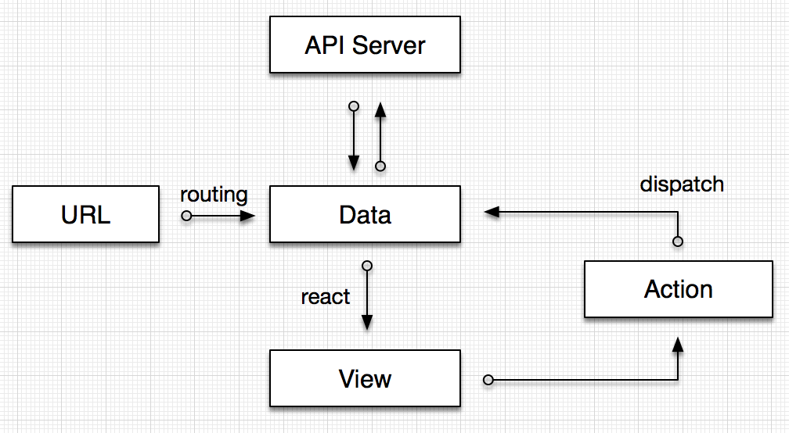
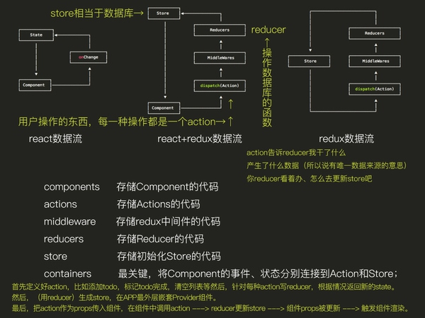

## [redux](http://cn.redux.js.org/index.html)

  > Redux 是为 Javascript 应用而生的可预估的状态容器。应用中所有的 state 都以一个对象树的形式储存在一个单一的 store 中。惟一改变 state 的办法是触发 action，一个描述发生什么的对象。为了描述 action 如何改变 state 树，你需要编写 reducers。[redux运行案例](./examples/redux.html)

* redux几个重要概念

  - store: 应用数据的存储中心，整个应用只能有一个 Store。由 Redux 的 createStore(reducer) 生成

  - state: 如果想得到某个时点的数据，就要对 Store 生成快照。这种时点的数据集合，就叫做 State。通过 store.getState() 获取，本质上一般是一个存储着整个应用状态的对象。Redux 规定， 一个 State 对应一个 View。只要 State 相同，View 就相同。

  - action: State 的变化必须是 View 导致的。Action 就是 View 发出的通知，表示 State 应该要发生变化了。应用数据的改变的描述, 本质上是一个包含 type 属性的普通对象，由 Action Creator (函数) 产生，改变 state 必须 dispatch 一个 action

  - dispatch: store.dispatch()是 View 发出 Action 的唯一方法。接受一个 Action 对象作为参数，将它发送出去。

  - subscribe: store.subscribe()设置监听函数，一旦 State 发生变化，就自动执行这个函数。store.subscribe方法返回一个函数，调用这个函数就可以解除监听。

  - reducer: Store 收到 Action 以后，必须给出一个新的 State，这样 View 才会发生变化。这种 State 的计算过程就叫做 Reducer。决定应用数据新状态的函数，接收应用之前的状态和一个 action 返回数据的新状态，reducer作为一个函数，可以根据web应用之前的状态（previousState）和交互行为（通过flux中提到的action来表征），决定web应用的下一状态（newState），从而实现state端的数据更新处理。本质上是根据 action.type 来更新 state 并返回 nextState 的函数，“更新” 并不是指 reducer 可以直接对 state 进行修改。Redux 规定，须先复制一份 state，在副本 nextState 上进行修改操作。

  - 纯函数: Reducer 函数最重要的特征是，它是一个纯函数。也就是说，只要是同样的输入，必定得到同样的输出。

  - middleware: redux 提供中间件的方式，完成一些 flux 流程的自定义控制，同时形成其插件体系

    [中间件案例](./examples/middle.html)

* 流程图

  component -> action -> reducer -> state 的单向数据流转

  Action Creator => action => store.dispatch(action) => reducer(state, action) => 原 state state = nextState

  

  

* 适合场景

  - 某个组件的状态，其他组件需要共享

  - 某个状态需要在任何地方都可以拿到，需要缓存(unmount -> mount)

  - 一个组件需要改变全局状态

  - 一个组件需要改变另一个组件的状态

  ```jsx
  const Counter = ({ value, onIncrement, onDecrement }) => (
    <div>
    <h1>{value}</h1>
    <button onClick={onIncrement}>+</button>
    <button onClick={onDecrement}>-</button>
    </div>
  );

  const reducer = (state = 0, action) => {
    switch (action.type) {
      case 'INCREMENT': return state + 1;
      case 'DECREMENT': return state - 1;
      default: return state;
    }
  };

  const store = createStore(reducer);

  const render = () => {
    ReactDOM.render(
      <Counter
        value={store.getState()}
        onIncrement={() => store.dispatch({type: 'INCREMENT'})}
        onDecrement={() => store.dispatch({type: 'DECREMENT'})}
      />,
      document.getElementById('root')
    );
  };

  render();
  store.subscribe(render);
  ```

* **redux的缺点**

  - 使用复杂，需要编写大量的代码，解决方案比较多，如dva、rematch、mirror等

  - 更新效率不高，由于使用的不可变数据模式，每次更新都会copy一份完整的state

  - 数据传递效率低，采用的context API一直存在传递效率问题

## 比较react

  a. 需要回调通知state (等同于回调参数) -> action  

  b. 需要根据回调处理 (等同于父级方法) -> reducer  

  c. 需要state (等同于总状态) -> store  

  - React有props和state: props意味着父级分发下来的属性，state意味着组件内部可以自行管理的状态，并且整个React没有数据向上回溯的能力，也就是说数据只能单向向下分发，或者自行内部消化。

  - React根本无法让两个组件互相交流，使用对方的数据。解决的唯一办法就是提升state，将state放到共有的父组件中来管理，再作为props分发回子组件。

  - 子组件改变父组件state的办法只能是通过onClick触发父组件声明好的回调，也就是父组件提前声明好函数或方法作为契约描述自己的state将如何变化，再将它同样作为属性交给子组件使用。

  - 为了面临所有可能的扩展问题，最容易想到的办法就是把所有state集中放到所有组件顶层，然后分发给所有组件。这就是redux诞生的背景

## 高阶组件

  由原始组件创造一个新的组件并且扩展它的行为。高阶组件通过包裹（wrapped）被传入的React组件，经过一系列处理，最终返回一个相对增强（enhanced）的React组件，供其他组件调用。

  高阶组件是通过将原组件 包裹（wrapping） 在容器组件（container component）里面的方式来 组合（composes） 使用原组件。高阶组件就是一个没有副作用的纯函数。
  
  ```jsx
  // MyComponent 是纯的 UI 组件
  <div className="index">
    <p>{this.props.text}</p>
    <input
      defaultValue={this.props.name}
      onChange={this.props.onChange}
    />
  </div>


  const App = connect(
    mapStateToProps,
    mapDispatchToProps
  )(MyComponent);

  // mapStateToProps: 定义 UI 组件参数与 State 之间的映射
  // mapDispatchToProps：定义 UI 组件与 Action 之间的映射

  function reducer(state = {
    text: '你好，访问者',
    name: '访问者'
  }, action) {
    switch (action.type) {
      case 'change':
        return {
          name: action.payload,
          text: '你好，' + action.payload
        };
    }
  }
  const initState = {};

  const store = createStore(reducer, initState);

  ReactDOM.render(
    <Provider store={store}>
      <App />
    </Provider>,
    document.body.appendChild(document.createElement('div'))
  );

  // Store由 Redux 提供的createStore方法生成，该方法接受reducer作为参数。
  // 为了把Store传入组件，必须使用 Redux 提供的Provider组件在应用的最外面，包裹一层。
  ```

  - 属性代理是最常见的高阶组件的使用方式，将被包裹组件的props和新生成的props一起传递给此组件，这称之为属性代理。

    ```js
    export default function withHeader(WrappedComponent) {
      return class HOC extends Component {
        render() {
          const newProps = {
            test:'hoc'
          }
          /* 透传props，并且传递新的newProps */
          return <div>
            <WrappedComponent {...this.props} {...newProps}/>
          </div>
        }
      }
    }
    ```

  - 基于反向继承的方式，React组件继承了被传入的组件，所以它能够访问到的区域、权限更多，相比属性代理方式，它更像打入组织内部，对其进行修改。

    ```js
    export default function (WrappedComponent) {
      return class Inheritance extends WrappedComponent {
        componentDidMount() {
          /* 可以方便地得到state，做一些更深入的修改 */
          console.log(this.state);
        }
        render() {
          return super.render();
        }
      }
    }
    ```

  - 组合多个高阶组件，高阶组件为React组件增强了一个功能，如果需要同时增加多个功能需要组合多个高阶组件，使用compose可以简化上述过程，也能体现函数式编程思想。

  compose可以帮助我们组合任意个（包括0个）高阶函数，例如compose(a,b,c)返回一个新的函数d，函数d依然接受一个函数作为入参，只不过在内部会依次调用c,b,a，从表现层对使用者保持透明。compose函数实现方式有很多种，这里推荐其中一个recompact.compose。

    ```js
    @withHeader
    @withLoading
    class Demo extends Component{ }

    /* use compose */
    const enhance = compose(withHeader,withLoading);
    @enhance
    class Demo extends Component{ }
    ```

  * 与父组件区别

  高阶组件作为一个函数，它可以更加纯粹地关注业务逻辑层面的代码，比如数据处理，数据校验，发送请求等，可以改善目前代码里业务逻辑和UI逻辑混杂在一起的现状。父组件则是UI层的东西，我们先前经常把一些业务逻辑处理放在父组件里，这样会造成父组件混乱的情况。为了代码进一步解耦，可以考虑使用高阶组件这种模式。

## 其他相关

* [flux](flux) 状态管理标准

* [react-redux](react-redux) React专用状态管理库

* [redux组件设计](reduxComponent)