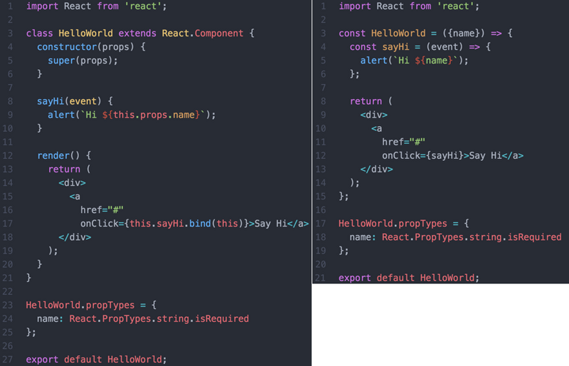

## React的概念和基本使用

  > 一个组件的渲染函数就是一个基于 state 和 props 的纯函数，state 是自己的，props 是外面来的，任何东西变了就重新渲染一遍.

* Element

  `React.createElement(element, props[, children])`, Element 是 createClass 的实例

* createClass

  `React.createClass({ ... })  `

  `class MyComponent extends React.Component { ... }`

* Component

  从 React 0.13 开始，可以使用 ES6 Class 代替 `React.createClass`, `class HelloMessage extends React.Component { ... }`

  区别: 

  + getInitialState() 取消，可以在构造函数中定义，如下：

    ```js
    => ES 6

    getInitialState() {
      return {

      }
    }

    或者 => ES 7

    constructor(props) {
      super(props);
    }

    state = {}
    ```

  + 静态设置改变

    ```js
    // 属性类型
    propTypes: {}

    => ES 6

    MyComponent.propTypes = {}

    或者 => ES 7

    static propTypes = {}
    ```

    ```js
    // 获取属性默认值
    getDefaultProps: function(){ return {...} }

    => ES 6

    MyComponent.defaultProps = {}

    或者 => ES 7

    static defaultProps = {}
    ```

  + props格式验证

    ```js
    => ES 6
    propTypes: {
      data: React.PropTypes.array.isRequired
    }

    => ES 7
    MyComponent.propTypes = {
      data: React.PropTypes.array.isRequired
    }
    ```

  + 绑定this作用域

    除了render方法都需要自己绑定指向当前Element的this对象, 以下几种方式：

    - =>箭头函数声明方式可以自动绑定(onClick={() => this.tick()})

    - 亦或者在构造函数中绑定(this.tick = this.tick.bind(this);)  -- 一次绑定随处可用

    - 亦或者在事件定义时绑定（onClick={this.click.bind(this)}）

  + 事件处理函数传参

    - `onClick={this.viewMore.bind(this, attributeId)}`

    - `onClick={(event)=>this.viewMore(attributeId, event)}`

    - `onClick={this.viewMore.bind(this)}  viewMore(event) {}`

    - `onClick={this.viewMore}  constructor() {this.viewMore=this.viewMore.bind(this);}`

* Factory

  简化了 React.createElement 的调用语法

  ```js
  var div = React.createFactory('div');
  var root = div({ className: 'my-div' });

  // Factory函数原理
  function createFactory(type) {
    return React.createElement.bind(null, type);
  }
  ```

* 受控组件 vs 非受控组件

  受控组件完全受控于react的state或props，由value和onChange事件控制，可以理解为react的双向绑定；

  非受控组件也就是不完全受控于state或props，换言之，组件没有state和props。

* 函数组件 vs 类组件

  
