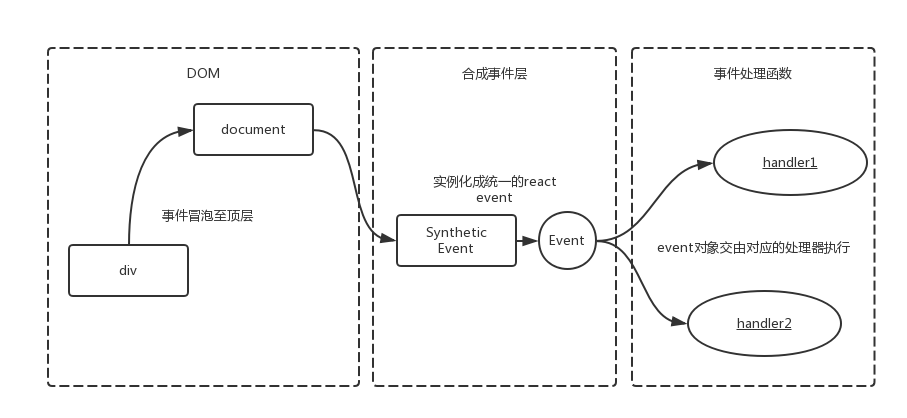

## react合成事件

React自己实现了一套高效的事件注册，存储，分发和重用逻辑，在DOM事件体系基础上做了很大改进，减少了内存消耗，简化了事件逻辑，并最大化的解决了IE等浏览器的不兼容问题。React并不是将click事件直接绑定在dom上面，而是采用事件冒泡的形式冒泡到document上面，然后React将事件封装给正式的函数处理运行和处理。react 默认事件代理的方式，实际上没有任何冒泡的过程，是程序自己模拟冒泡的操作。

  ```js
  class ExampleApplication extends Component {
    constructor() {
        super(arguments);
    }
    componentDidMount() {
        this.parent.addEventListener('click', (e) => {
          console.log('dom parent');
        });
        this.child.addEventListener('click', (e) => {
          console.log('dom child');
        });
        document.addEventListener('click', (e) => {
          console.log('document');
        });
    }
    childClick = () => {  
        console.log('react child');
    }
    parentClick = () => {  
        console.log('react parent');
    }
    render() {
      <div onClick={this.parentClick} ref={ref => this.parent = ref}>
        <div onClick={this.childClick} ref={ref => this.child = ref}>
        </div>
      </div>
    }
  }
  // dom child
  // dom parent
  // react child
  // react parent
  // document
  ```

  

  - react的所有事件都挂载在document中

  - 当真实dom触发后冒泡到document后才会对react事件进行处理

  - 所以原生的事件会先执行

  - 然后执行react合成事件

  - 最后执行真正在document上挂载的事件

* 合成事件机制

  react事件机制分为三个部分:

  - 事件注册部分，所有的事件都会注册到document上，拥有统一的调函数dispatchEvent来执行事件分发。React使用对象池来管理合成事件对象的创建和销毁，这样减少了垃圾的生成和新对象内存的分配，大大提高了性能。

    + 触发document注册原生事件的回调dispatchEvent
    + 获取到触发这个事件最深一级的元素
    + 遍历这个元素的所有父元素，依次对每一级元素进行处理。
    + 构造合成事件。
    + 将每一级的合成事件存储在eventQueue事件队列中。
    + 遍历eventQueue。
    + 通过isPropagationStopped判断当前事件是否执行了阻止冒泡方法。
    + 如果阻止了冒泡，停止遍历，否则通过executeDispatch执行合成事件。
    + 释放处理完成的事件。

  - 事件分发部分，首先生成合成事件，注意同一种事件类型只能生成一个合成事件Event，如onclick这个类型的事件，dom上所有带有通过jsx绑定的onClick的回调函数都会按顺序（冒泡或者捕获）会放到Event._dispatchListeners 这个数组里，后面依次执行它。也就是说，React以队列的方式，从触发事件的组件向父组件回溯，调用它们在JSX中声明的callback，React自身实现了一套事件冒泡机制。

  - 事件存储部分，合成事件以对象池的方式实现创建和销毁，大大提高了性能。

* 合成事件主要的实现类

  - ReactEventListener：负责事件注册和事件分发。React将DOM事件全都注册到document这个节点上，这个我们在事件注册小节详细讲。事件分发主要调用dispatchEvent进行，从事件触发组件开始，向父元素遍历。我们在事件执行小节详细讲。

  - ReactEventEmitter：负责每个组件上事件的执行。

  - EventPluginHub：负责事件的存储，合成事件以对象池的方式实现创建和销毁，大大提高了性能。

  - SimpleEventPlugin等plugin：根据不同的事件类型，构造不同的合成事件。比如：focus对应的React合成事件为SyntheticFocusEvent。其他合成事件插件包括：EnterLeaveEventPlugin，ChangeEventPlugin，SelectEventPlugin，BeforeInputEventPlugin。

### 常见问题

  - 阻止冒泡，合成事件的stopPropagation只能阻止合成事件的冒泡，对原生事件无效。而原生事件的阻止冒泡可以阻止合成事件。

    + event.stopPropagation：在react事件回调函数中调用能阻止react合成事件的冒泡。其实，React合成事件封装的stopPropagtion函数在调用时给自己加了个isPropagationStopped的标记位来确定后续监听器是否执行。

    + event.nativeEvent.stopPropagation：阻止的是代理到根元素（如document）的事件。

    + event.nativeEvent.stopImmediatePropagation： 阻止调用相同类型事件的其他侦听器，除了该事件的冒泡行为被阻止之外(event.stopPropagation方法的作用), 该元素绑定的后序相同类型事件的监听函数的执行也将被阻止。所以可以阻止和react一样代理在document上的事件，如jquery中的 $(document).on('click', function(){});

  - 在react里面，如果在异步函数里获取合成事件的属性，结果会是null；

    原因：合成事件对象是复用的，事件回调处理函数执行完后，相关的属性都会被清空，待下次事件使用。

    解决方案：可以在异步函数之前用变量缓存合成事件的属性值。

    ```js
    handleChange(event) {
      console.log(event.type);   /* change */

      setTimeout(() => {
        console.log(event.type);
      });
    }
    ```

  - 将合成事件作为props传给子组件，会有警告信息提示；解决方案同上。

  `Warning: This synthetic event is reused for performance reasons. If you're seeing this, you're accessing the property target on a released/nullified synthetic event. This is set to null. If you must keep the original synthetic event around, use event.persist(). See https://fb.me/react-event-poo... for more information.`

  - 需要使用浏览器原生事件，可以通过合成事件的nativeEvent属性获取

* vs 原生事件

  - target值不同，代理在Document或者react container元素

  - 属性值有差别

  - 在 React 中你不能通过返回false 来阻止默认行为，必须明确调用 preventDefault。

  - 事件名称小驼峰写法，传递的参数是回调函数，而不是函数字符串

* vs jQuery事件系统

  - 事件对象复用，一般无法异步使用事件对象

  - 没有自定义事件

### 为何要手动绑定this?

react对生命周期的钩子函数都进行this绑定，但是对开发者自定义的函数并没有绑定this指向。其实，在react@0.13版本之前，
React createClass这个API是默认绑定this的，绝大部分情况很安逸，但是开发者缺失去了对context的控制权。

```js
// dispatchEvent调用了invokeGuardedCallback方法
function invokeGuardedCallback(name, func, a) {
  try {
    func(a);  // 回调函数是直接调用，并没有指定组件
  } catch (x) {
    if (caughtError === null) {
      caughtError = x;
    }
  }
}
```


## 参考资料

[react为何不像vue一样自动绑定所有函数的this指向？](https://www.zhihu.com/question/300850914)