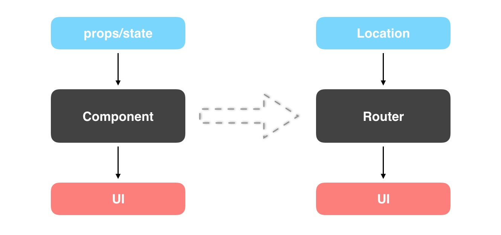
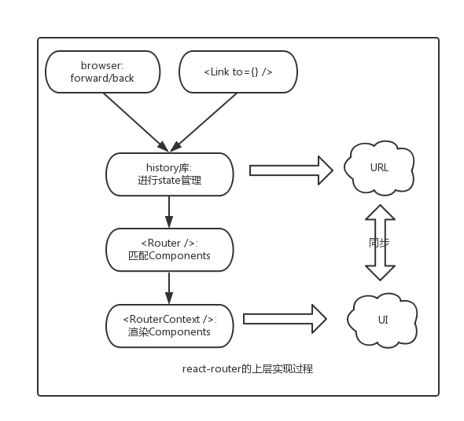

## react-router

React Router 保持 UI 与 URL 同步。它拥有简单的 API 与强大的功能例如代码缓冲加载、动态路由匹配、以及建立正确的位置过渡处理。在react-router中，URL对应Location对象，而UI是由react components来决定的，这样就转变成location与components之间的同步问题。


```js
import React from 'react';
import { render, findDOMNode } from 'react-dom';
import { Router, Route, Link, IndexRoute, Redirect } from 'react-router';
import { createHistory, createHashHistory, useBasename } from 'history';

// 此处用于添加根路径
const history = useBasename(createHashHistory)({
  queryKey: '_key',
  basename: '/blog-app',
});

React.render((
  <Router history={history}>
    <Route path="/" component={BlogApp}>
      <IndexRoute component={SignIn}/>
      <Route path="signIn" component={SignIn}/>
      <Route path="signOut" component={SignOut}/>
      <Redirect from="/archives" to="/archives/posts"/>
      <Route onEnter={requireAuth} path="archives" component={Archives}>
        <Route path="posts" components={{
          original: Original,
          reproduce: Reproduce,
        }}/>
      </Route>
      <Route path="article/:id" component={Article}/>
      <Route path="about" component={About}/>
    </Route>
  </Router>
), document.getElementById('example'));
```

* 实现原理

  

* 组成部分

  - location

    ```json
    {
      pathname, // url的基本路径
      search, // 查询字段
      hash, // url中的hash值
      state, // url对应的state字段
      action, // 分为 push、replace、pop三种
      key // 生成方法为: Math.random().toString(36).substr(2, length)
    }
    ```

  - Router: 它的history对象是整个路由系统的核心，它暴露了很多属性和方法在路由系统中使用

  - Route: path 属性表示路由组件所对应的路径，可以是绝对或相对路径，相对路径可继承；onEnter 钩子将用于在渲染对象的组件前做拦截操作，比如验证权限；可以使用 component 指定单个组件，或者通过 components 指定多个组件集合；

  - Redirect: 是一个重定向组件，有 from 和 to 两个属性；

  - state: location.state, 共享数据，为了维护state的状态，将其存储在sessionStorage里面。

  - param: 通过 `/:param` 的方式传递

  - Link: 组件最终会渲染为 HTML 标签 `<a>`，它的 to、query、hash 属性会被组合在一起并渲染为 href 属性。虽然 Link 被渲染为超链接，但在内部实现上使用脚本拦截了浏览器的默认行为，然后调用了history.pushState 方法

### history

history用于记录浏览器的会话历史记录，可以实现前进后退等跳转功能。在HTML5规范中，W3C规范使用pushState和replaceState方法来修改浏览器URL地址，而不触发页面重载，实际上，router的browserHistory也是类似的。

  - hashHistory   通过URL的hash部分（#）切换页面，优点是不需要服务端配置，缺点是不够清爽不够优雅，容易拼接和编码造成丢失。

  - browserHistory  需要服务端进行配置，否则访问非首页地址时会出现404。这是因为，路径指向服务器的真是路径，而该路径并没有相关的资源，所以返回资源不存在。要让页面正常运行，我们需要让页面在访问这些url的时候返回单页应用的index.html，然后再从前端解析到正确的路由进行加载。

    + 开发服务器使用webpack-dev-server，加上 `--history-api-fallback`参数就可以。`webpack-dev-server --inline --content-base . --history-api-fallback`

    + 开发服务器是Nginx时，*.conf 配置

      ```json
      {
        server {
          location / {  // nginx 只匹配 / ，剩下的应该由react-router
            try_files $uri /index.html
          }
        }
      }
      ```
  - memoryHistory  node环境下，主要存储在memeory里面

* history的常用API

  ```json
  {
    listenBefore, // 内部的hook机制，可以在location发生变化前执行某些行为，AOP的实现
    listen, // location发生改变时触发回调
    transitionTo, // 执行location的改变
    push, // 改变location
    replace,
    go,
    goBack,
    goForward,
    createKey, // 创建location的key，用于唯一标示该location，是随机生成的
    createPath,
    createHref,
    createLocation, // 创建location
  }
  ```


