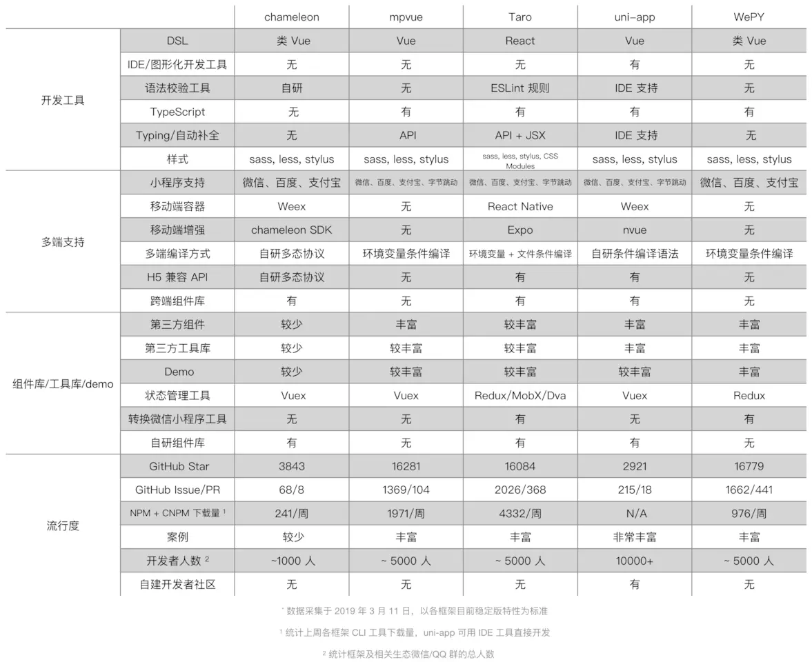

## uniapp vs mpvue vs taro

所有小程序代码都在 worker 线程上运行，最终在 worker 线程生成一棵 dom tree，再把 dom tree 同步到 render 线程上通过 w/axml 进行渲染。

### Taro vs Remax vs Kbone

| 对比项 | Taro | Remax | Kbone |
| ---- | ----- | ----- | ---- |
| 公司 |  京东 |  蚂蚁  |  腾讯  |
| 架构 | render线程(view)与 worker线程(逻辑)，setData和event通信  |  同左  |  同左  |
| 多平台转换 |  编译时转换 |  运行时  |  运行时  |
| 适配框架 |  react |  react  |  react、vue、原生js  |
| 流程 |  编译转换多套代码文件，适配多平台 | 自定义的 renderer，diff vdom tree patch同步到render线程 |  适配dom api，将完整的tree同步到render线程，wxml渲染 |

### 参考资料

[微信原生、wepy、mpvue、uni-app、taro，小程序主流开发框架](http://ask.dcloud.net.cn/article/35867)

[小程序多端框架全面测评](https://juejin.im/post/5c90eb366fb9a070d4199cc9)
