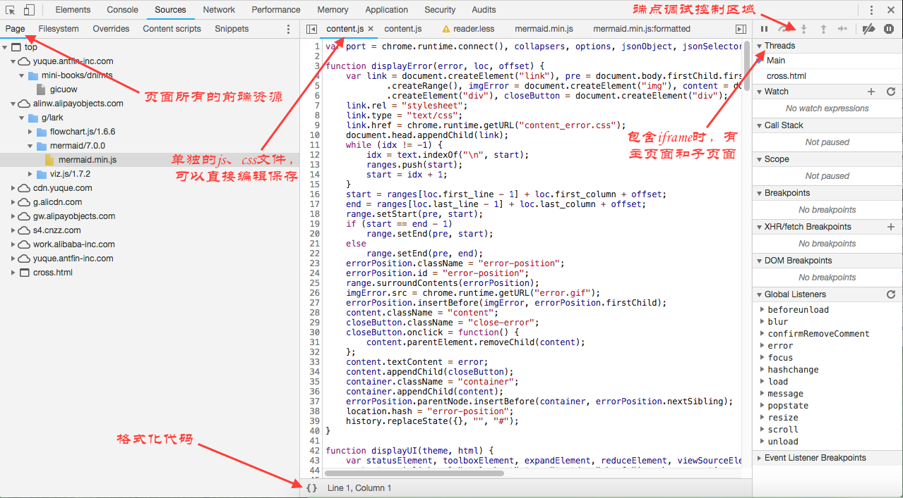
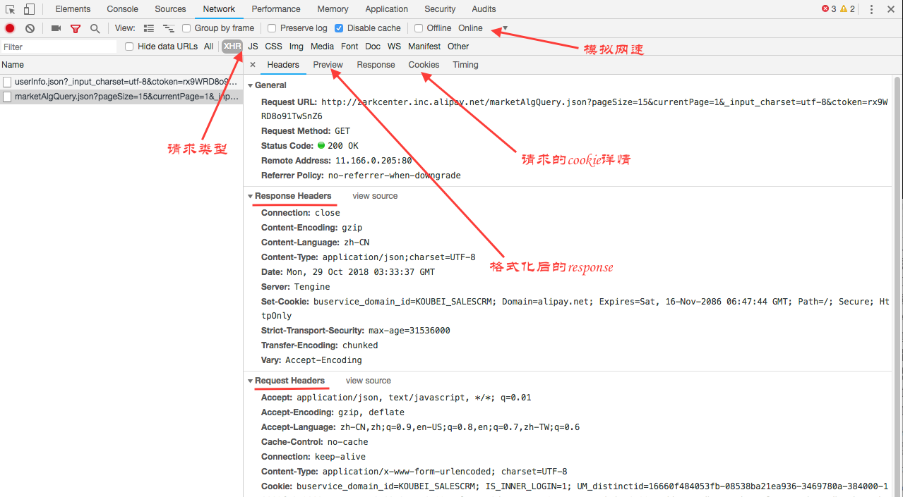

## chrome 调试技巧

* css样式调试

  

* js调试

  - sources breakpoints

    

  - 请求详情查看

    

  - console大法

  - debugger

* 代理调试

  - charles, Fiddle, devServer.proxy, SwitchyOmega

* 模拟

  - mockjs

## chrome其他技巧

- 1、把console内的代码添加到sources

  在代码最后加上    `//@ sourceURL = name.js;`

- 2、快捷键操作

  * ctrl + shift + o （cmd+shift+o）搜寻sources里的函数名称，

  * Ctrl + D (Cmd + D) 选择下一个匹配的匹配项

  * ctrl + o/p (cmd+o/p) 搜寻文件名，

  * ctrl+shift+f (cmd+opt+f) 搜寻所有文件内容

  * ctrl + g (too) 跳转到行

  * shift + click 改变element颜色的格式

- 3、常用chrome插件：

  + Advanced REST client: REST API调试插件

  + Infinity新标签页: 个性化新标签页面

  + Google Art Project: 艺术画新标签

  + JSONView: JSON文件页面格式化展示

  + Tunnello: 翻墙插件

  + React Developer Tools: React调试页面

  + Octotree: GitHub左侧目录树，方便快速打开

  + Wappalyzer 分析网站使用的技术 它可以检测网页的 Web 服务器、JS 框架等等

  + The Great Suspender 把后台闲置的标签页都休眠，并可以将休眠时间设定为从 20 秒到 3 天。被休眠的标签页在这段时间内就不会占用到你的内存，从而让你的电脑处理速度有所提升。

* 4、Workspaces功能

  通过 Workspace，你可以把本地服务器的资源映射为硬盘上的文件，实现调试 JS 和 CSS 的同时自动保存文件。  

  「Add folder to workspace」 --> 「Map to file system resource...」, 具体的文件映射规则可以到 Devtools > Settings > Workspace 中设置。  

* 5、Sinppets功能

  Sources下面的左侧的Sinppets代码片段按钮，可以保存一些调试或测试代码小片段，并且可以端点调试，反复运行。

  [snippets调试调用堆栈](../images/stack.png)

## chrome 调试知识点

* Content scripts: 指的是Chrome拓展注入在网页中的脚本。比如安装了一个叫 JSONView的Chrome拓展

* call stack 当前调试的函数的调用栈，也就是调用记录

* scope 当前函数的作用域链，local表示当前局部作用域，closure表示作用域链中的闭包，global表示全局作用域

* step over next function call
  跨过，实际表现是不遇到函数时，执行下一步。遇到函数时，不进入函数直接执行下一步。

* step into next function call
  跨入，实际表现是不遇到函数时，执行下一步。遇到到函数时，进入函数执行上下文。

* step out of current function
  跳出当前函数

## 移动端调试

* usb调试打开，usb连接方式选择“MTP（媒体传输协议）”，重启app或者浏览器，打开chrome调试窗口。

  遇到问题：检查是否重启app或者浏览器，以及app或者浏览器是否为开发版，是否需要打开调试接口，是否有网络代理干扰
