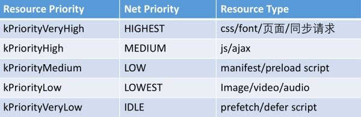

## chrome加载资源的优先级

- （1）每个域每次最多同时加载6个资源（http/1.1）

- （2）CSS具有最高的优先级，最先加载，即使是放在最后面的css也是比前面资源先开始加载

- （3）JS比图片优先加载，即使出现得比图片晚

- （4）只有等CSS都加载完了，才能加载其它的资源，即使这个时候没有达到6个的限制

- （5）head里面的非高优化级的资源最多能先加载一张

- （6）xhr的资源虽然具有高优先级，但是由于它是排在3.js后面的，JS的执行是同步的，所以它排得比较靠后，如果把它排在1.js前面，那么它也会比图片先加载。

