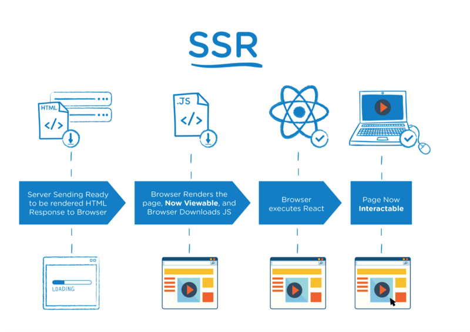

## 服务端渲染和客户端渲染

在 SSR 中，服务端接收到请求后就在服务端将 HTML 页面生成好，然后将之返回给客户端，客户端拿到完整的 HTML 很快便能够将页面渲染出来，用户便能看到页面，与此同时，客户端也在拉取 JS 等其他资源，当 JS 拉取到本地并执行完后，页面就变得可交互了。

而CSR 中，将HTML、JS等资源拉取到本地，由本地执行 JS，获取数据，然后渲染页面，渲染出的页面可以立即交互。对比上面两种渲染方式可以看出，服务端渲染以客户看到页面为第一要务，也就是很多公司考核的首屏加载时间，交互可以放在次要的位置。

