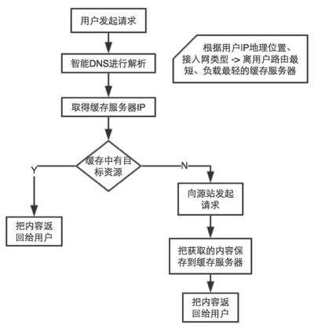

## CDN

> 通过负载均衡技术，将不同地点的用户请求定向到最合适的缓存服务器上去获取内容，以减少源站的服务器压力，解决因分布、带宽、服务器性能带来的访问延迟问题。

## CDN地址

收藏的比较常用的cdn

[BootCDN](http://www.bootcdn.cn/)

[CDNJS](https://cdnjs.com/)

[微信CDN](http://qydev.weixin.qq.com/cdn/cdnjs.html)
