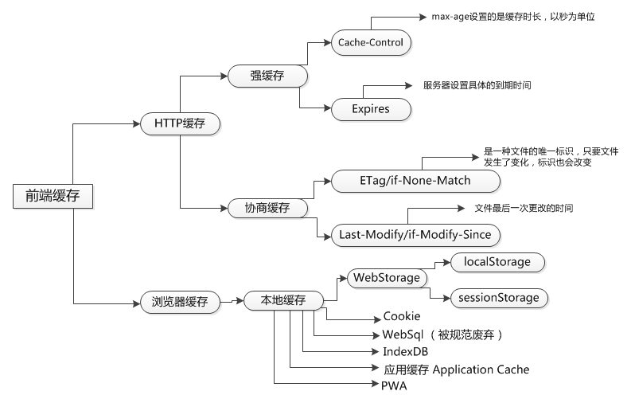

## **浏览器缓存**

浏览器第一次向服务器发起该请求并拿到请求结果后，将请求结果和缓存标识存入浏览器缓存，浏览器对于缓存的处理是根据第一次请求资源时返回的响应头来确定的。另外，浏览器每次发起请求，都会先在浏览器缓存中查找该请求的结果以及缓存标识；浏览器每次拿到返回的请求结果都会将该结果和缓存标识存入浏览器缓存中。



### 按失效策略，浏览器缓存分为：强制缓存和协商缓存，优先读取强制缓存。

* 强缓存：不会向服务器发送请求，直接从缓存中读取资源，在chrome控制台的network选项中可以看到该请求返回200的状态码，并且size显示from disk cache或from memory cache；在浏览器中，浏览器会在js和图片等文件解析执行后直接存入内存缓存中；而css文件则会存入硬盘文件中，所以每次渲染页面都需要从硬盘读取缓存(from disk cache)。
  
强制缓存分为：expires 和 cache-control，其中expires是一个特定的时间，是比较旧的标准；而cache-control是一个具体的时间长度，比较新的标准，优先级也比较高。

**cache-control** 这是一个相对时间，在配置缓存的时候，以秒为单位，用数值表示。当值设为max-age=300时，则代表在这个请求正确返回时间（浏览器也会记录下来）的5分钟内再次加载资源，就会命中强缓存。比如：`Cache-Control: max-age=300`。Cache-Control是http1.1的产物，优先级高于Expires。

  + public：所有内容都将被缓存（客户端和代理服务器都可缓存）。

  + private：所有内容只有客户端可以缓存，代理服务器不可以缓存，Cache-Control的默认取值。

  + no-cache: 强制向源服务器再次验证，响应中包含no-cache，那么缓存服务器则不能对资源进行缓存。需要注意的是，no-cache这个名字有一点误导,设置了no-cache之后，并不是说浏览器就不再缓存数据，只是浏览器在使用缓存数据时，需要先确认一下数据是否还跟服务器保持一致，可以理解为协商缓存.

  + no-store：所有内容都不会被缓存，即不使用强制缓存，也不使用协商缓存

  + max-age: 响应的最大Age值（s）


* 协商缓存：向服务器发送请求，服务器会根据这个请求的request header的一些参数来判断是否命中协商缓存，如果命中，则返回304状态码并带上新的response header通知浏览器从缓存中读取资源；另外协商缓存需要与cache-control共同使用, 协商缓存经常作为在强制缓存失效后的一种后备方案。

协商缓存包括：etag 和 last-modified，last-modified的设置标准是资源的上次修改时间；而etag是为了应对资源修改时间可能很频繁的情况出现的，是基于资源的内容计算出来的值，因此优先级也较高，精度也要优于last-modified。

* 协商缓存与强制缓存的区别在于，强制缓存不需要访问服务器，返回结果是状态码200；协商缓存需要访问服务器，如果命中缓存的话，返回结果是304。

强制缓存优先于协商缓存进行，若强制缓存(Expires和Cache-Control)生效则直接使用缓存，若不生效则进行协商缓存(Last-Modified / If-Modified-Since和Etag / If-None-Match)，协商缓存由服务器决定是否使用缓存，若协商缓存失效，那么代表该请求的缓存失效，重新获取请求结果，再存入浏览器缓存中；生效则返回304，继续使用缓存。


```js
// 字段优先级，越大越高
cache-control > expires > etag > last-modified

// 协商缓存
last-modified: Wed, 16 May 2018 02:57:16 GMT
if-modified-since: Wed, 16 May 2018 05:55:38 GMT

if-none-match: "D5FC8B85A045FF720547BC36FC872550"
etag: "D5FC8B85A045FF720547BC36FC872550"

// 强制缓存
expires: Thu, 16 May 2019 03:05:59 GMT

cache-control: max-age=31536000
```

备注：post(put)请求不能被缓存，设置了`Cache-Control:no-cache，pragma:no-cache，或Cache-Control:max-age=0`头信息的请求也不能被缓存。https请求可强制缓存。

- 用户行为对浏览器缓存的影响

  + 地址栏访问，链接跳转是正常用户行为，将会触发浏览器缓存机制；

  + F5刷新，浏览器会设置max-age=0，跳过强缓存判断，会进行协商缓存判断；

  + ctrl+F5/command+R刷新，跳过强缓存和协商缓存，直接从服务器拉取资源。

### 按缓存位置，浏览器缓存分为

* memory cache

  memory cache 是内存中的缓存，(与之相对 disk cache 就是硬盘上的缓存)。按照操作系统的常理：先读内存，再读硬盘。几乎所有的网络请求资源都会被浏览器自动加入到 memory cache 中，但它必将短暂，tab关闭或者缓存溢出都会导致memory cache失效。在从 memory cache 获取缓存内容时，浏览器会忽视例如 max-age=0, no-cache 等头部配置。

  - preloader

  preloader 没有一个官方标准，所以每个浏览器的处理都略有区别。例如有些浏览器还会下载 css 中的 `@import` 内容或者 `<video>` 的 poster等。

  - preload

  显式指定的预加载资源，也会被放入 memory cache 中。例如 `<link rel="preload">`

* disk cache

  disk cache 也叫 HTTP cache，顾名思义是存储在硬盘上的缓存，因此它是持久存储的，是实际存在于文件系统中的。而且它允许相同的资源在跨会话，甚至跨站点的情况下使用，例如两个站点都使用了同一张图片。

  凡是持久性存储都会面临容量增长的问题，disk cache 也不例外。在浏览器自动清理时，会有神秘的算法去把“最老的”或者“最可能过时的”资源删除，因此是一个一个删除的。不过每个浏览器识别“最老的”和“最可能过时的”资源的算法不尽相同，可能也是它们差异性的体现。

* service worker

  Service Worker 能够操作的缓存是永久缓存，除非主动去删除或者容量超过限制，具体位置参见 Application -> Cache Storage 。

  Service Worker 没能命中缓存，一般情况会使用 fetch() 方法继续获取资源。浏览器就去 memory cache 或者 disk cache 中继续匹配缓存是否命中。值得注意的是，即使是没有命中service worker的缓存，也会被标注为 from serviceworker。

* request network

  上述 3 个位置都没有找到缓存，那么浏览器会正式发送网络请求去获取内容。

* 总结流程

  ```
  service worker -> fetch -> memory cache -> disk cache -> 强缓存 -> 协商缓存 -> request -> 缓存disk cache
  ```

### 浏览器不缓存方案

```html
<meta http-equiv="Cache-control" content="no-cache, no-store, must-revalidate">
<meta http-equiv="Pragma" content="no-cache">
<meta http-equiv="Expires" content="Mon, 26 Jul 1997 05:00:00 GMT">
<meta http-equiv="Last-Modified" content="Sat, 10 Nov 1997 09:08:07 GMT">
```

或者url拼接 时间戳、hash值

### 参考资料

[深入理解浏览器的缓存机制](https://www.jianshu.com/p/54cc04190252)

[一文读懂前端缓存](https://juejin.im/post/5c22ee806fb9a049fb43b2c5?utm_source=gold_browser_extension)