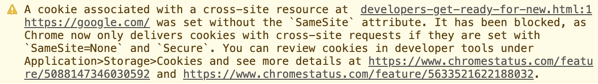
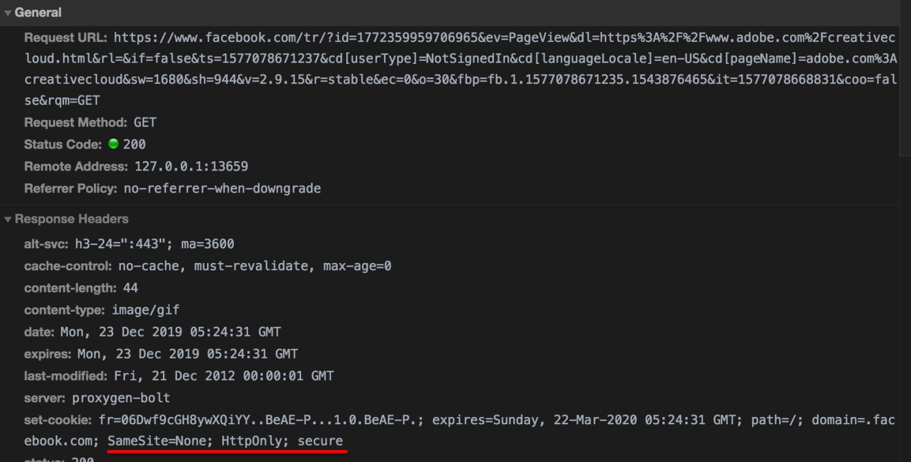
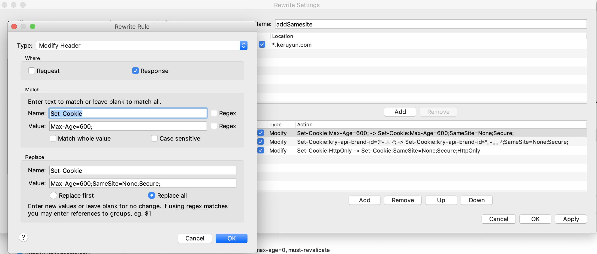

## Samesite

在 Chrome 80 中，Chrome 会将没有声明 SameSite 值的 cookie 默认设置为SameSite=Lax。只有采用SameSite=None; Secure设置的 cookie 可以从外部访问，前提是通过安全连接（即 HTTPS）访问。

* 常见现象

当网页中包含跨站点 Cookie 且缺少必需设置时 开发者工具控制台 会发出警告。如果您在开发者工具中查看站点信息时看到了这些警告，则可能表示支持您网站功能的 Cookie 未能正确配置。以下是 Chrome 80 和早期的 Chrome（77 以上）版本中开发者工具控制台的警告：

* 解决方案

* 使用charles修改samesite值

### 参考资料

[chrome80稳定版发布](https://www.oschina.net/news/113190/chrome-80-stable-released)

[SameSite Cookie 变更：您需要了解的都在这里](https://mp.weixin.qq.com/s/a1wh4teTPIq4AcC6g09mRw)