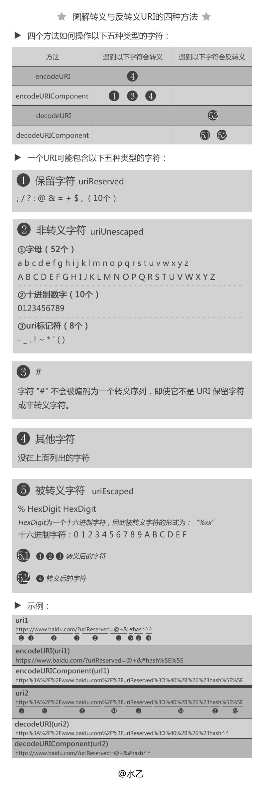

## Unicode vs GBK vs Utf-8

  > unicode，gbk和大五码就是编码的值(二进制符号)，并且三者不兼容，而utf-8,uft-16之类就是这个值(符号)的表现形式，如汉字和英文字母。uft-8转换成GBK，必须先转成成Unicode，再转GBK。

  * **ASCII**

    八个二进制位就可以组合出256种状态，这被称为一个字节（byte）, 也就是一个字节都可以表示256个字符。上个世纪60年代，美国制定了一套字符编码，对英语字符与二进制位之间的关系，做了统一规定。这被称为 ASCII 码，一直沿用至今。

    ASCII 码一共规定了128个字符的编码，比如空格SPACE是32（二进制00100000），大写的字母A是65（二进制01000001）。这128个符号（包括32个不能打印出来的控制符号），只占用了一个字节的后面7位，最前面的一位统一规定为0。一个字节只能表示256种符号，肯定是不够的，就必须使用多个字节表达一个符号。比如，简体中文常见的编码方式是 GB2312，使用两个字节表示一个汉字，所以理论上最多可以表示 256 x 256 = 65536 个符号。

  * **Unicode**

    Unicode(Universal Multiple-Octet Coded Character Set)是一种字符编码方法，简称为UCS。UCS可以看作是"Unicode Character Set"的缩写。不过它是由国际组织设计，可以容纳全世界所有语言文字的编码方案。将世界上所有的符号都纳入其中，每一个符号都给予一个独一无二的编码，又叫码点，它是一个很大的集合，现在的规模可以容纳100多万个符号。比如，U+0639表示阿拉伯字母Ain，U+0041表示英语的大写字母A，U+4E25表示汉字严。具体的符号对应表，可以查询[unicode.org](http://www.unicode.org/)， 或者专门的[汉字对应表](http://www.chi2ko.com/tool/CJK.htm)。

    历史上存在两个试图独立设计Unicode的组织，即国际标准化组织（ISO）和一个软件制造商的协会（unicode.org）。ISO开发了ISO 10646项目，Unicode协会开发了Unicode项目。目前两个项目仍都存在，并独立地公布各自的标准。Unicode协会现在的最新版本是2005年的Unicode 4.1.0。ISO的最新标准是10646-3:2003。

    UCS有两种格式：UCS-2和UCS-4。顾名思义，UCS-2就是用两个字节编码，UCS-4就是用4个字节（实际上只用了31位，最高位必须为0）编码。JavaScript语言采用Unicode字符集，但是只支持一种编码方法。JavaScript用的是UCS-2！两者的关系简单说，就是UTF-16取代了UCS-2，或者说UCS-2整合进了UTF-16。所以，现在只有UTF-16，没有UCS-2。由于JavaScript只能处理UCS-2编码，造成所有字符在这门语言中都是2个字节，如果是4个字节的字符，会当作两个双字节的字符处理。UCS规定了怎么用多个字节表示各种文字。怎样传输这些编码，是由UTF(UCS Transformation Format)规范规定的，常见的UTF规范包括UTF-8、UTF-7、UTF-16。

    Unicode 并没有统一规定每个符号用三个或者四个字节表示。Unicode 只规定了每个字符对应到唯一的代码值（code point），代码值 从 0000 ~ 10FFFF 共 1114112 个值 ，真正存储的时候需要多少个字节是由具体的编码格式决定的。比如：字符 「A」用 UTF-8 的格式编码来存储就只占用1个字节，用 UTF-16 就占用2个字节，而用 UTF-32 存储就占用4个字节。

    ```js
    String.fromCodePoint()  // 从Unicode码点返回对应字符
    String.prototype.codePointAt()  // 从字符返回对应的码点
    String.prototype.at() // 返回字符串给定位置的字符
    ```

    [Unicode扩展阅读](http://pcedu.pconline.com.cn/empolder/gj/other/0505/616631_all.html#content_page_2)

  * **GB码**

    - GB2312

      早期的计算机使用7位的ASCII编码，为了处理汉字，程序员设计了用于简体中文的GB2312和用于繁体中文的big5。GB2312(1980年)一共收录了7445个字符，包括6763个汉字和682个其它符号。

    - GBK1.0

      1995年的汉字扩展规范GBK1.0收录了21886个符号，它分为汉字区和图形符号区。汉字区包括21003个字符。

    - GB18030

      2000年的GB18030是取代GBK1.0的正式国家标准。该标准收录了27484个汉字，同时还收录了藏文、蒙文、维吾尔文等主要的少数民族文字。
    
    <u>从ASCII、GB2312、GBK到GB18030，这些编码方法是向下兼容的，即同一个字符在这些方案中总是有相同的编码，后面的标准支持更多的字符。而Unicode只与ASCII兼容（更准确地说，是与ISO-8859-1兼容），与GB码不兼容。例如“汉”字的Unicode编码是6C49，而GB码是BABA。</u>

  * **UTF-8**

    UTF-8 就是在互联网上使用最广的一种 Unicode 的实现方式。其他实现方式还包括 UTF-16（字符用两个字节或四个字节表示）和 UTF-32（字符用四个字节表示），不过在互联网上基本不用。UTF-16的编码长度要么是2个字节（U+0000到U+FFFF），要么是4个字节（U+010000到U+10FFFF）。

    UTF-8 最大的一个特点，就是它是一种变长的编码方式。它可以使用1~4个字节表示一个符号，根据不同的符号而变化字节长度。越是常用的字符，字节越短，最前面的128个字符，只使用1个字节表示，与ASCII码完全相同。

    UTF-8 的编码规则很简单，只有二条：

      - 1）对于单字节的符号，字节的第一位设为0，后面7位为这个符号的 Unicode 码。因此对于英语字母，UTF-8 编码和 ASCII 码是相同的。

      - 2）对于n字节的符号（n > 1），第一个字节的前n位都设为1，第n + 1位设为0，后面字节的前两位一律设为10。剩下的没有提及的二进制位，全部为这个符号的 Unicode 码。

    | UCS-2编码(16进制)     | 	 UTF-8 字节流(二进制) |
    | -------------------  |  ------------------   |
    | 0x0000 - 0x007F      |	 0xxxxxxx            |
    | 0x0080 - 0x07FF	     |  110xxxxx 10xxxxxx    |
    | 0x0800 - 0xFFFF      |	1110xxxx 10xxxxxx 10xxxxxx |
    | 0x010000 - 0x10FFFF  |	1110xxxx 10xxxxxx 10xxxxxx 10xxxxxx |

    例如“汉”字的Unicode编码是6C49。6C49在0800-FFFF之间，所以肯定要用3字节模板了：1110xxxx 10xxxxxx 10xxxxxx。将6C49写成二进制是：0110 110001 001001， 用这个比特流依次代替模板中的x，得到：11100110 10110001 10001001，即E6 B1 89。

  **[ASCII、Unicode 扩展阅读](http://www.ruanyifeng.com/blog/2007/10/ascii_unicode_and_utf-8.html)**

  **[ASCII <-转换-> Unicode <-转换-> 中文](http://tool.chinaz.com/Tools/Unicode.aspx)**

<br /><br />

## escape vs encodeURI(unicode vs utf-8)

  * **escape**

    escape方法把字符串生成十六进制转义序列字符（特色字符如: @*_+-./ 被排除在外），当该值小于等于0xFF时,用一个2位转移序列: %xx 表示. 大于的话则使用4位序列:%uxxxx 表示。目前该方法以及废弃，推荐使用encodeURI。escape 的编码有一个弊端在于，它后面是4位16进制，故不支持基本多文种平面（BMP）外的字符（unicode大于0xffff）的字符；而encodeURI是基于 UTF-8的，编码本身理论上可以支持0x10ffff内的字符（实际上现在的JavaScript不支持BMP外的字符，所以encodeURI也不支持 ）。

    ```js
    escape("äöü");        // "%E4%F6%FC"
    escape("ć");          // "%u0107"
    ```

  * **encodeURI**

    encodeURI方法主要针对URL地址， encodeURI方法不会对下列字符编码： ASCII字母、数字、~!@#$&*()=:/,;?+'，
    


  * **encodeURIComponent**

    encodeURIComponent方法不会对下列字符编码： ASCII字母、数字、~!*()'

    备注：escape 在处理0xff之外字符的时候，是直接使用字符的unicode在前面加上一个 「%u」，而encodeURI则是先进行UTF-8，再在UTF-8的每个字节码前加上一个「%」；在处理0xff以内字符时，编码方式是一样的（都是「%XX」，XX为字符的16进制unicode，同时也是字符的UTF-8），只是范围（即哪些字符编码哪些字符不编码）不一样。encodeURI 是W3C 的标准，而 escape 是非标准。

    | 字符 | UTF-8编码十进制 | UTF-8编码十六进制  | Unicode编码十进制  | Unicode编码十进制 |
    | ---- |  -----------  |  ---------   |  ---------  |  ---------  |
    |   ä    |    50084    |  	C3A4      |	    228	    |    E4    |
    |   ö    |	  50102    |  	C3B6      |	    246     |	   F6    |
    |   ü    |	  50108    |  	C3BC      |	    252     |	   FC    |
    |   ć    |	  50311    |  	C487      |	    263     |	   107   |


备注：（侵图必删）