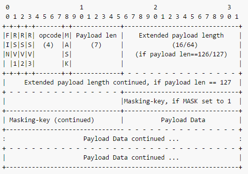

## websocket

 > Websocket借用了HTTP的协议来完成一部分握手，是一个持久化的协议，是相对于HTTP这种非持久(长连接，循环连接不算)的协议来说，更像是HTTP协议上的一种补充。Web Socket 是一种 HTML 5 为 Web 定制的全双工通讯协议，没有“请求 - 响应”的概念，浏览器与服务器完全平等，连接一旦建立就一直开放，双方可随时向对方发送任意数据，没有推拉之分。  

ws最大的优势：在于服务器和客户端可以在给定的时间范围内的任意时刻，相互推送信息，数据的传输使用帧来传递，并且允许跨域通信。  

目前主流的浏览器都支持WebSocket，并且有第三方的API：Guillermo Rauch创建了一个Socket.IO，遵循Engine.IO协议[Engine.IO protocol](https://github.com/socketio/engine.io-protocol)。  

* 发送包类型：

    - 0: open  transport is opened(传输打开)
    - 1: close
    - 2: ping  Send by client. Server should answer with a pong packet containing the same data
    - 3: pong  Sent by the server to respond to ping packets.
    - 4: message  actual message, client and server should call their callbacks with the data.(callback - 42, not - 41)
    - 5: upgrade  polling or websoket
    - 6: noop  等待

* 数据成帧

    WebSocket 使用了自定义的二进制分帧格式，把每个应用消息切分成一或多个帧，发送到目的地之后再组装起来，等到接收到完整的消息后再通知接收端。基本的成帧协议定义了帧类型有操作码、有效载荷的长度，指定位置的Extension data和Application data，统称为Payload data，保留了一些特殊位和操作码供后期扩展。在打开握手完成后，终端发送一个关闭帧之前的任何时间里，数据帧可能由客户端或服务器的任何一方发送。具体的帧格式如下所示：

    

    - FIN： 1 bit 。FIN是FINAL的缩写，它为1时表示一个数据传输结束。此位标示此帧是否是消息的最后帧，第一帧也可能是最后帧。
    
    - RSV1，RSV2，RSV3： 各1 bit 。必须是0，除非协商了扩展定义了非0的意义。
    
    - opcode：4 bit。表示被传输帧的类型：x0 表示一个后续帧；x1 表示一个文本帧；x2 表示一个二进制帧；x3-7 为以后的非控制帧保留；x8 表示一个连接关闭；x9 表示一个ping；xA 表示一个pong；xB-F 为以后的控制帧保留。同一个数据即使分片传输，它的每个数据帧的Opcode也应该相同。
    
    - Mask： 1 bit。表示净荷是否有掩码（只适用于客户端发送给服务器的消息）。
    
    - Payload length： 7 bit, 7 + 16 bit, 7 + 64 bit。 净荷长度由可变长度字段表示： 如果是 0~125，就是净荷长度；如果是 126，则接下来 2 字节表示的 16 位无符号整数才是这一帧的长度； 如果是 127，则接下来 8 字节表示的 64 位无符号整数才是这一帧的长度。
    
    - Masking-key：0或4 Byte。 用于给净荷加掩护，客户端到服务器标记。
    
    - Extension data： x Byte。默认为0 Byte，除非协商了扩展。
    
    - Application data： y Byte。 在”Extension data”之后，占据了帧的剩余部分。
    
    - Payload data： (x + y) Byte。”extension data” 后接 “application data”。

* 生成(封装)数据帧

    待续...

* 解析数据帧

    ```js
    function decodeDataFrame(e) {
        var i = 0, j, s, frame = {
            //解析前两个字节的基本数据
            FIN: e[i]>>7,
            Opcode: e[i++]&15,
            Mask: e[i]>>7,
            PayloadLength: e[i++]&0x7F
        };
        //处理特殊长度126和127
        if(frame.PayloadLength == 126)
            frame.length = (e[i++]<<8)+e[i++];
        if(frame.PayloadLength==127)
            frame.length = (e[i++]<<24)+(e[i++]<<16)+(e[i++]<<8)+e[i++];
        //判断是否使用掩码
        if(frame.Mask){
            //获取掩码实体
            frame.MaskingKey = [e[i++],e[i++],e[i++],e[i++]];
            //对数据和掩码做异或运算
            for(j = 0, s = []; j < frame.PayloadLength; j++)
                s.push(e[i+j]^frame.MaskingKey[j%4]);
        } else {
            s = e.slice(i,frame.PayloadLength); //否则直接使用数据
        }
        //数组转换成缓冲区来使用
        s = new Buffer(s);
        //如果有必要则把缓冲区转换成字符串来使用
        if(frame.Opcode == 1) s = s.toString();
        //设置上数据部分
        frame.PayloadData = s;
        //返回数据帧
        return frame;
    };
    function onmessage(e){
        e = decodeDataFrame(e); //解析数据帧
        console.log(e); //把数据帧输出到控制台
    };  
    ```

* **example:**

    client connects through new transport

    client sends 2probe

    server receives and sends 3probe

    client receives and sends 5
    
    server flushes and closes old transport and switches to new.