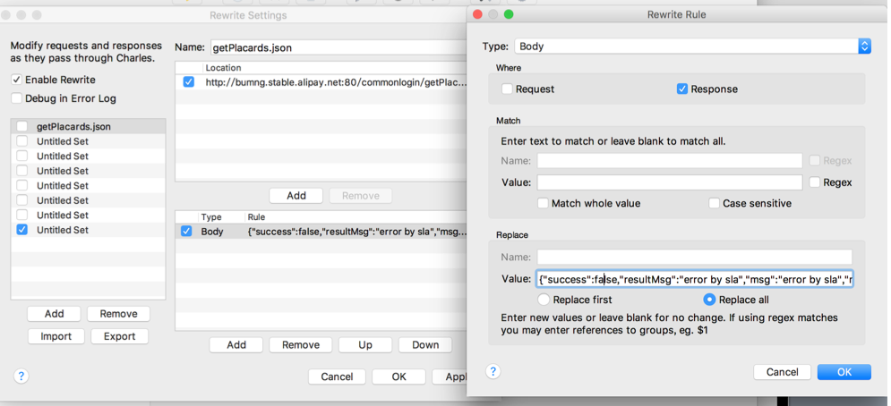

## charles 代理

    > Charles是在Mac下常用的截取网络封包的工具，有两种视图“Structure”(域名分类)和"Sequence"(时间排序)

- Recording Settings 记录设置

  - Include：包括配置规则的请求会被记录到 session 中，默认为空

  - Exclude：不包含配置规则的请求会被记录

- Map Local

  > Map 功能适合长期地将某一些请求重定向到另一个网络地址或本地文件.

  勾选 enable map local，charles 就可以按照规则，把请求的对应目录（或文件）换成本地的目录（或文件）

  如果需要抓取 https，则需要勾选 Enable SSL proxying，添加想要的域名和端口,否则代理 not working

  备注：弹出的编辑窗里不用挨个填，把整个网址输到 host，会自动帮你把网址解析成 host、path、query 等部分

  

- Rewrite

  > Rewrite 功能功能适合对某一类网络请求进行一些正则替换，以达到修改结果的目的。

  location 和 rule 编辑，支持字符匹配和正则表达式

  Rewrite 功能很强大的，包括 header 的增删改和 param 的增删改，还有 body 修改等。

  

- Map Remote

  类似于 map local, 只是替换成另外一个网址。

- proxy setting

  > 同一个局域网内的其他设备做代理

  只需要勾选 Enable transparent HTTP proxying，默认使用 8888 端口, 然后在移动设备上设置代理地址：电脑的 ip:8888 就可以了

* Throttle Setting(网络延迟设置)

## charles 代理手机

- wifi 代理设置

  - wifi -> `cycle263`进入高级设置 -> http 代理 -> 手动 192.168.1.4:8888(PC 端 IP, 必须为同一网段，否则无效)

- https 代理设置

  - Charles Help -> SSL Proxying -> Install Charles Root Certificate on a Mobile Device

  - 手机端访问弹出框的提示地址`chls.pro/ssl`，出现证书安装页面，点击安装

  - Charles Proxy -> SSL Proxying Settings... -> 勾选 Enable SSL Proxying -> Add 需要代理的地址和端口

    `as.tests.com:443`

- 反抓包

  判断手机是否使用了代理

### 参考资料

[charles 入门到精通](http://blog.devtang.com/2015/11/14/charles-introduction/)

[charles 破解](https://www.cnblogs.com/rrl92/p/7928770.html)

[charles 深入理解](https://juejin.im/post/5a1033d2f265da431f4aa81f)
