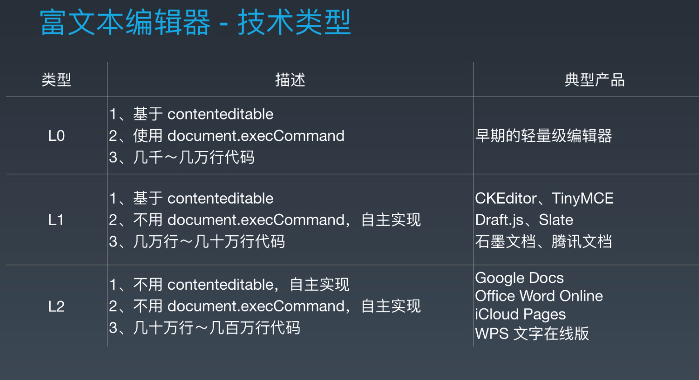

## 知名的富文本编辑器

  WYSIWYG(what you see is what you get)

* Ueditor

* kindeditor

* simditor

* bootstrap-wysiwyg

* [wangEditor](http://wangEditor.github.io/)

* CKeditor

* [MediumEditor](https://yabwe.github.io/medium-editor/)

### [tinymce](https://github.com/tinymce/tinymce)

### Slate

### Draft.js

基于draft.js开发的react富文本编辑器

* [braft-editor](https://braft.margox.cn/)    

  **重点推荐**

  是一款基于 draft-Js 和 ant-design 实现的 react 富文本编辑器组件。

* [react-lz-editor](https://github.com/leejaen/react-lz-editor)   

  **重点推荐**

  也是一款基于 draft-Js 和 ant-design 实现的 react 富文本编辑器组件。

* react-rte

* [react-draft-wysiwyg](https://jpuri.github.io/react-draft-wysiwyg)

### wysihtml

### ckeditor5

### markdown系列编辑器

基于markdown打造的富文本编辑器

* [simplemde-markdown-editor](https://simplemde.com/)

* react-markdown-editor

* CycleEditor

#### 参考资料

[语雀富文本演进](https://myslide.cn/slides/21863)
