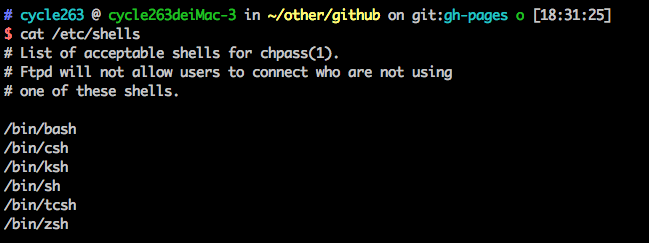

## shell

Shell 既是一种脚本编程语言，也是一个连接内核和用户的软件。常见的 Shell 脚本解析器 有 sh、bash、csh、tcsh、ash 等。bash shell 是 Linux 的默认 shell，由 GNU 组织开发，保持了对 sh shell 的兼容性，是各种 Linux 发行版默认配置的 shell。

* 查看支持的shell

  Shell 是一个程序，一般都是放在/bin或者/user/bin目录下，当前 Linux 系统可用的 Shell 都记录在/etc/shells文件中。/etc/shells是一个纯文本文件，你可以在图形界面下打开它，也可以使用 cat 命令查看它。

  

* 默认shell

  `echo $SHELL` 输出SHELL环境变量，也就是默认shell
  `chsh -s /bin/bash`  修改默认SHELL为bash，一般情况下，`/bin/zsh` 都链接指向 `/bin/bash`

* 当前用户目录

  在Linux中，~ 表示代码主目录，也就是当前登录用户的用户目录。相当于 `/Users/cycle263/`

## Linux常用的shell命令


* **FILE COMMANDS(文件命令)**  

  - ls: 显示目录  

    + ls -la l(long)、a(all)列出所有(包含隐藏)文件的详情信息

    + ls -t 按更改时间排序

  - cd: 切换目录  

    cd - 后退到上次目录  

  - vi: 编辑器指令 +n 打开文件，光标定位第n行 + 打开文件，光标定位最后一行

    打开文件后，按下insert键或者i键为"insert"编辑状态，ESC键返回命令状态。命令状态下：

    **移动光标类命令**

      h ：光标左移一个字符
      l ：光标右移一个字符
      space：光标右移一个字符
      Backspace：光标左移一个字符
      k或Ctrl+p：光标上移一行
      j或Ctrl+n ：光标下移一行
      Enter ：光标下移一行
      w或W ：光标右移一个字至字首
      b或B ：光标左移一个字至字首
      e或E ：光标右移一个字j至字尾
      ) ：光标移至句尾
      ( ：光标移至句首
      }：光标移至段落开头
      {：光标移至段落结尾
      nG：光标移至第n行首
      n+：光标下移n行
      n-：光标上移n行
      n$：光标移至第n行尾
      H ：光标移至屏幕顶行
      M ：光标移至屏幕中间行
      L ：光标移至屏幕最后行
      0：（注意是数字零）光标移至当前行首
      $：光标移至当前行尾

    **屏幕翻滚类命令**

      Ctrl+u：向文件首翻半屏
      Ctrl+d：向文件尾翻半屏
      Ctrl+f：向文件尾翻一屏
      Ctrl＋b；向文件首翻一屏
      nz：将第n行滚至屏幕顶部，不指定n时将当前行滚至屏幕顶部。

    **插入文本类命令**

      i ：在光标前
      I ：在当前行首
      a：光标后
      A：在当前行尾
      o：在当前行之下新开一行
      O：在当前行之上新开一行
      r：替换当前字符
      R：替换当前字符及其后的字符，直至按ESC键
      s：从当前光标位置处开始，以输入的文本替代指定数目的字符
      S：删除指定数目的行，并以所输入文本代替之
      ncw或nCW：修改指定数目的字
      nCC：修改指定数目的行

    **删除命令**

      dd: 删除游标所在的一整行(常用)
      ndd: n为数字。删除光标所在的向下n行，例如20dd则是删除光标所在的向下20行
      d1G: 删除光标所在到第一行的所有数据
      dG: 删除光标所在到最后一行的所有数据
      d$: 删除光标所在处，到该行的最后一个字符
      d0: 那个是数字0,删除光标所在到该行的最前面的一个字符
      x,X: x向后删除一个字符(相当于[del]按键),X向前删除一个字符(相当于[backspace]即退格键)
      nx: n为数字，连续向后删除n个字符
      
      ndw或ndW：删除光标处开始及其后的n-1个字
      do：删至行首
      d$：删至行尾
      ndd：删除当前行及其后n-1行
      x或X：删除一个字符，x删除光标后的，而X删除光标前的
      Ctrl+u：删除输入方式下所输入的文本

    **搜索及替换命令 :**

      /pattern：从光标开始处向文件尾搜索pattern
      ?pattern：从光标开始处向文件首搜索pattern
      n：在同一方向重复上一次搜索命令
      N：在反方向上重复上一次搜索命令
      ：s/p1/p2/g：将当前行中所有p1均用p2替代
      ：n1,n2s/p1/p2/g：将第n1至n2行中所有p1均用p2替代
      ：g/p1/s//p2/g：将文件中所有p1均用p2替换

    **选项设置**

      all：列出所有选项设置情况
      term：设置终端类型
      ignorance：在搜索中忽略大小写
      list：显示制表位(Ctrl+I)和行尾标志（$)
      number：显示行号
      report：显示由面向行的命令修改过的数目
      terse：显示简短的警告信息
      warn：在转到别的文件时若没保存当前文件则显示NO write信息
      nomagic：允许在搜索模式中，使用前面不带“”的特殊字符
      nowrapscan：禁止vi在搜索到达文件两端时，又从另一端开始
      mesg：允许vi显示其他用户用write写到自己终端上的信息

    **最后行方式命令**

      ：n1,n2 co n3：将n1行到n2行之间的内容拷贝到第n3行下
      ：n1,n2 m n3：将n1行到n2行之间的内容移至到第n3行下
      ：n1,n2 d ：将n1行到n2行之间的内容删除
      ：w ：保存当前文件
      ：e filename：打开文件filename进行编辑
      ：x：保存当前文件并退出
      ：q：退出vi
      ：q!：不保存文件并退出vi
      ：!command：执行shell命令command
      ：n1,n2 w!command：将文件中n1行至n2行的内容作为command的输入并执行之，若不指
      定n1，n2，则表示将整个文件内容作为command的输入
      ：r!command：将命令command的输出结果放到当前行。

  - pwd: 显示当前路径

  - mkdir: 创建目录

  - mv: 移动或者重命名 -f(强行移动/重命名), -i(移动/重命名前尝试), -u(更新)

    `mv cronfile.txt myfile.txt  // 将cronfile.txt重命名为myfile.txt`

  - rm: 删除文件 -r 删除目录 -f 强制删除

  - cp: 拷贝文件 -r 递归拷贝 -f 强制拷贝

  - touch: 创建文件

  - cat <file>: 显示文件内容

  - echo: 打印

  - tail <file>: 显示文件后十行

  - ctrl+r: 搜索最近使用的命令

  - history: 显示最近使用过的所有命令

  - sudo: super user do 以超级用户执行

  - chmod: 修改权限（777）

  - grep: 强大的文件搜索工具

  - whereis: 只能用于程序名的搜索

  - locate: find -name的另一种写法，但要比后者快得多，因为其不搜索具体目录，而是搜索一个数据库（/var/lib/locatedb）

  - which: 在PATH变量指定的路径中搜索某个系统命令的为止，并且返回第一个搜索结果

  ```js
  grep foo /etc/passwd
  返回在password文件中所有的含有foo的行

  grep -i “foo” /etc/passwd
  -i选项是忽略大小写，这就意味着若某一行含有FOO或FOo也会被搜索到。

  grep还支持递归搜索：
  `grep -r “foo” /home/sjvn`
  这条命令将会搜索/home/sjvn目录及其子目录下所有的包含“foo”的行

  grep也通常与其他命令串连起来使用，例如：
  `ls -la | grep foo*`
  列出当前目录下任何以foo开头的文件或目录。例如如下文件将被匹配：foo，foobar，foolish.txt等等。
  ```
